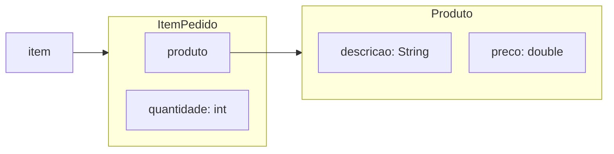
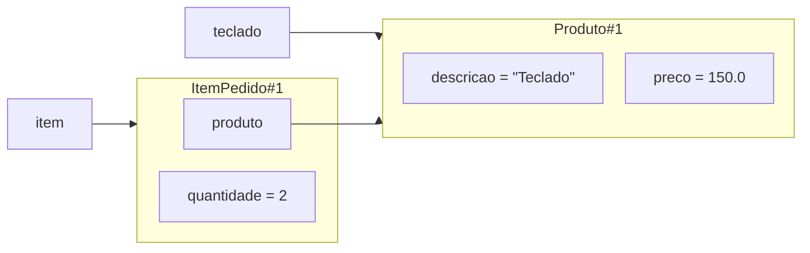

# Aula 06 — Colaboração entre objetos

Na Aula 05, fizemos `ItemPedido` nascer com um estado coerente. A solução ainda guarda no item a descrição e o preço do produto, além da quantidade. Isso funciona para um exemplo pequeno, mas começa a incomodar quando percebemos que parte dessas informações não pertence propriamente ao item.

**Slides:** [Apresentação HTML](../slides/rendered/aula-06-colaboracao-entre-objetos.html) · [PDF](../slides/rendered/aula-06-colaboracao-entre-objetos.pdf)

!!! lesson-question "Pergunta central"

    Quando uma operação depende de informações que pertencem a objetos diferentes, quem deve fazer o quê?

!!! lesson-objectives "Objetivos"

    Ao final deste estudo, você deverá ser capaz de:

    - reconhecer quando um objeto precisa colaborar com outro para cumprir sua responsabilidade;
    - explicar como um campo pode manter uma referência para outro objeto;
    - distribuir entre `Produto` e `ItemPedido` os estados e comportamentos que cabem a cada um;
    - explicar por que passar um objeto como argumento não cria automaticamente uma cópia;
    - ler uma colaboração simples em que um objeto solicita uma informação a outro.

<!-- bloco-didatico: 6.1 | estimativa: 20–25 min -->

## O que estamos repetindo em cada item?

Considere dois itens do mesmo produto, criados em momentos diferentes:

```java
ItemPedido itemDaManha =
    new ItemPedido("Teclado", 150.0, 2);

ItemPedido itemDaTarde =
    new ItemPedido("Teclado", 150.0, 1);
```

Cada item precisa de sua própria quantidade: um representa duas unidades e o outro, uma. Mas descrição e preço também foram copiados para os dois objetos. Se o preço do teclado precisar mudar para `160.0`, quantos lugares terão de ser encontrados e atualizados?

O problema não é apenas digitar o mesmo valor mais de uma vez. Os dois objetos passam a manter versões próprias de uma informação que descreve o mesmo produto. Nada impede que o programa termine assim:

| Objeto | Descrição | Preço | Quantidade |
| --- | --- | ---: | ---: |
| `itemDaManha` | Teclado | 150.0 | 2 |
| `itemDaTarde` | Teclado | 160.0 | 1 |

Qual é o preço do teclado nesse modelo: `150.0` ou `160.0`?

!!! activity "Atividade — o que pertence a quem?"

    No Projeto 1, um produto existe no catálogo mesmo antes de participar de um pedido. Nesta versão do modelo, o item ainda não representa uma compra fechada: ele usa o preço atual mantido no catálogo. Um item representa certa quantidade desse produto em um pedido.

    Registre sua decisão antes de continuar:

    1. quais informações continuam fazendo sentido quando pensamos apenas no produto?
    2. qual informação pode variar entre participações do mesmo produto em itens diferentes?
    3. quem conhece o preço?
    4. quem conhece a quantidade?

??? "Ver resposta"

    1. Descrição e preço continuam fazendo sentido em `Produto`.
    2. A quantidade varia entre os itens de um mesmo produto e pertence a `ItemPedido`.
    3. `Produto` conhece o preço.
    4. `ItemPedido` conhece a quantidade e mantém uma referência para o produto.

Uma distribuição possível começa a aparecer:

- `Produto` mantém sua descrição e seu preço;
- `ItemPedido` mantém a quantidade daquele item;
- para representar **qual** produto participa do item, `ItemPedido` precisa conhecer um objeto `Produto`.

Separar as responsabilidades resolve a duplicação, mas cria uma nova necessidade: os dois objetos não podem mais trabalhar isoladamente.

Essa distribuição depende da regra adotada nesta etapa: o subtotal acompanha o preço atual do catálogo. Em um sistema que precise preservar o preço praticado no momento da compra, o item teria outra responsabilidade e o modelo exigiria uma decisão diferente. Essa variação não será desenvolvida agora.

!!! trap "Armadilha — mover também a quantidade para `Produto`"

    A quantidade não descreve o produto em si. O mesmo teclado pode aparecer com quantidade `2` em um item e quantidade `1` em outro. Colocá-la em `Produto` misturaria o estado do produto com o estado de uma participação específica em um pedido.

<!-- bloco-didatico: 6.2 | estimativa: 30–35 min -->

## Como um item pode conhecer um produto?

Podemos começar pela classe que representa as informações do produto:

```java
public class Produto {
    private String descricao;
    private double preco;

    public Produto(String descricao, double preco) {
        this.descricao = descricao;

        if (preco >= 0) {
            this.preco = preco;
        }
    }

    public double getPreco() {
        return preco;
    }
}
```

Essa classe protege o estado que lhe pertence e oferece operações de consulta. Agora `ItemPedido` pode receber um `Produto` quando for criado:

```java
public class ItemPedido {
    private Produto produto;
    private int quantidade;

    public ItemPedido(Produto produto, int quantidade) {
        this.produto = produto;

        if (quantidade >= 0) {
            this.quantidade = quantidade;
        }
    }

    public Produto getProduto() {
        return produto;
    }

    public int getQuantidade() {
        return quantidade;
    }
}
```

Nesta aula, consideramos que o parâmetro `produto` recebe uma referência para um `Produto` existente. A possibilidade de não haver um produto associado e as formas de tratar essa situação exigem decisões adicionais; elas não fazem parte do problema que estamos resolvendo agora.

O campo `produto` não contém uma descrição nem um preço copiado. Ele mantém uma referência que permite ao item chegar a um objeto `Produto`.

Neste diagrama, a caixa vermelha pequena representa uma variável; os contêineres azuis representam objetos; as linhas internas representam campos; e cada seta significa **aponta para**. Para manter o foco nessa colaboração, `String` aparece como um valor conceitual do domínio, embora também seja um tipo de referência em Java.



!!! java-focus "Java em foco — um tipo de classe também pode ser tipo de campo"

    Em `private Produto produto;`, o primeiro `Produto` é o tipo do campo e `produto` é seu nome. O campo pode manter uma referência para um objeto dessa classe.

    A mesma leitura vale para o parâmetro `Produto produto`: ele recebe uma referência para um objeto `Produto`. Nenhum novo produto é criado por essa declaração.

!!! conceito-chave "Conceito-chave — colaboração entre objetos"

    Objetos colaboram quando um deles solicita a outro uma informação ou um comportamento necessário para cumprir sua própria responsabilidade. Cada participante contribui com aquilo que conhece ou sabe fazer.

### Quem calcula o subtotal?

Depois de separar os estados, nenhum dos dois objetos conhece sozinho todos os valores do cálculo:

- `Produto` conhece o preço, mas não a quantidade do item;
- `ItemPedido` conhece a quantidade e sabe qual produto participa do item.

Ainda faz sentido que o subtotal seja responsabilidade de `ItemPedido`: ele representa aquela participação específica no pedido e pode pedir ao produto o preço de que precisa.

```java
public double calcularSubtotal() {
    return produto.getPreco() * quantidade;
}
```

Leia a expressão da esquerda para a direita:

1. `produto` acessa a referência mantida pelo item;
2. `produto.getPreco()` solicita o preço ao objeto `Produto`;
3. `quantidade` vem do estado do próprio `ItemPedido`;
4. o item combina as duas informações e devolve seu subtotal.

O produto fornece uma informação que lhe pertence. O item preserva a responsabilidade pelo cálculo que depende de sua quantidade.

!!! activity "Atividade — quem deve fazer o quê?"

    Considere um `Produto` de preço `150.0` e um `ItemPedido` desse produto com quantidade `3`.

    Antes de continuar, registre uma explicação para cada pergunta:

    1. por que `Produto` deve fornecer o preço?
    2. por que `Produto` não consegue calcular sozinho o subtotal desse item?
    3. por que `ItemPedido` não precisa copiar o preço para conseguir calcular?
    4. qual consulta o item faz durante `item.calcularSubtotal()` e qual valor deve ser devolvido?

    O subtotal esperado é `450.0`. Confira se sua explicação percorre a consulta ao preço do produto e o uso da quantidade mantida pelo item.

??? "Ver resposta"

    1. `Produto` fornece o preço porque essa informação pertence ao seu estado.
    2. Ele não calcula sozinho o subtotal porque não conhece a quantidade do item.
    3. `ItemPedido` não copia o preço: solicita `produto.getPreco()`.
    4. O item multiplica `150.0` por sua quantidade `3` e devolve `450.0`.

O novo modelo não eliminou `calcularSubtotal()`. Ele mudou a maneira pela qual o item consegue a informação necessária. A operação agora torna visível uma colaboração.

<!-- bloco-didatico: 6.3 | estimativa: 25–30 min -->

## O construtor recebe outro objeto — quantos objetos existem?

Vamos criar e conectar os objetos:

```java
Produto teclado = new Produto("Teclado", 150.0);
ItemPedido item = new ItemPedido(teclado, 2);
```

!!! activity "Atividade — acompanhe a referência"

    Considere o código completo da criação acima. Sem executar, registre suas respostas:

    1. quantos objetos do modelo foram criados explicitamente pelas expressões `new` mostradas?
    2. quantas referências permitem chegar ao objeto `Produto` depois da segunda linha?
    3. qual expressão criaria de fato outro produto com outra identidade?
    4. qual resultado você prevê para `teclado == item.getProduto()` e por quê?

??? "Ver resposta"

    1. Foram criados dois objetos do modelo: um `Produto` e um `ItemPedido`.
    2. Duas referências chegam ao produto: a variável `teclado` e o campo `produto` do item.
    3. `new Produto("Teclado", 150.0)` criaria outro produto, com outra identidade.
    4. `teclado == item.getProduto()` resulta em `true`, pois as duas referências chegam ao mesmo objeto.

As duas expressões `new` mostradas criam explicitamente dois objetos do nosso modelo: um `Produto` e um `ItemPedido`.

Na segunda linha, o argumento `teclado` fornece ao parâmetro `produto` do construtor a referência que já permite chegar ao produto existente:

```java
public ItemPedido(Produto produto, int quantidade) {
    this.produto = produto;
    // preparação da quantidade
}
```

O parâmetro recebe a referência; a atribuição guarda essa referência no campo do novo item. Não aparece `new Produto(...)` dentro do construtor, portanto nenhum segundo produto é criado.



Podemos verificar a identidade compartilhada:

```java
System.out.println(teclado == item.getProduto()); // true
```

`teclado` e o campo `produto` do item permitem chegar ao mesmo objeto. O campo não é o objeto e não contém uma cópia automática dele; é mais uma referência para a mesma identidade.

Compare suas previsões com o diagrama e o resultado. Se alguma resposta divergir, acompanhe novamente quais expressões executam `new` e quais apenas transmitem uma referência existente.

!!! conceito-chave "Conceito-chave — objetos como argumentos"

    Quando um objeto é passado como argumento, o parâmetro recebe uma referência para esse objeto. A passagem não executa `new` nem cria automaticamente uma cópia independente.

### A mesma ideia em outro domínio

<!-- aprofundamento-elastico -->

Uma pousada mantém objetos `Quarto`, cada um com seu número e valor da diária. Uma `Reserva` mantém a quantidade de noites e precisa calcular o valor da estadia para um quarto específico.

Sem implementar as classes completas, considere:

```java
Quarto quarto = new Quarto(12, 180.0);
Reserva reserva = new Reserva(quarto, 3);

double total = reserva.calcularTotal();
```

Registre uma proposta e sua justificativa:

1. quem deve conhecer o valor da diária?
2. quem deve conhecer a quantidade de noites?
3. quem deve calcular o total da estadia?
4. de qual informação esse objeto precisa solicitar ao colaborador?
5. quantos objetos são criados nesse trecho?

??? "Ver resposta"

    1. `Quarto` deve conhecer o valor da diária.
    2. `Reserva` deve conhecer a quantidade de noites.
    3. `Reserva` deve calcular o total da estadia.
    4. Para isso, solicita ao quarto o valor da diária.
    5. As duas expressões `new` criam dois objetos do modelo: um `Quarto` e uma `Reserva`.

Use suas respostas para verificar se a distribuição de responsabilidades continua fazendo sentido em outro domínio, sem desenvolver as classes completas.

## O que o modelo ainda não resolve?

Agora conseguimos representar um produto e um item que colabora com ele. Um pedido real, porém, reúne vários itens.

Então, sim: um `Pedido` deverá conseguir manter e gerenciar um conjunto de itens. O modelo atual ainda não faz isso. Resolver esse problema exigirá representar vários objetos `ItemPedido`, percorrê-los e coordenar operações sobre o conjunto.

Não vamos introduzir uma coleção antes de ela ser necessária e antes de consolidarmos a colaboração simples entre dois objetos. Essa tensão fica aberta como continuidade do Projeto 1 e gancho para os próximos pares.

## Fechando a trajetória

!!! synthesis "Síntese"

    Começamos com descrição e preço repetidos em cada item. Ao perguntar o que pertence a quem, separamos o estado de `Produto` do estado de `ItemPedido` e criamos uma colaboração:

    - `Produto` mantém descrição e preço;
    - `ItemPedido` mantém quantidade e uma referência para um produto;
    - `calcularSubtotal()` continua no item e solicita o preço ao produto;
    - passar o produto ao construtor transmite uma referência, não cria uma cópia;
    - a colaboração entre dois objetos está resolvida, mas o gerenciamento de vários itens ainda não.

## Material da aula

- [Aula 05 — Construtores e estado inicial válido](aula-05-construtores-e-estado-inicial-valido.md)
- [Java essencial para quem já sabe programar](../materiais/java-essencial.md)
