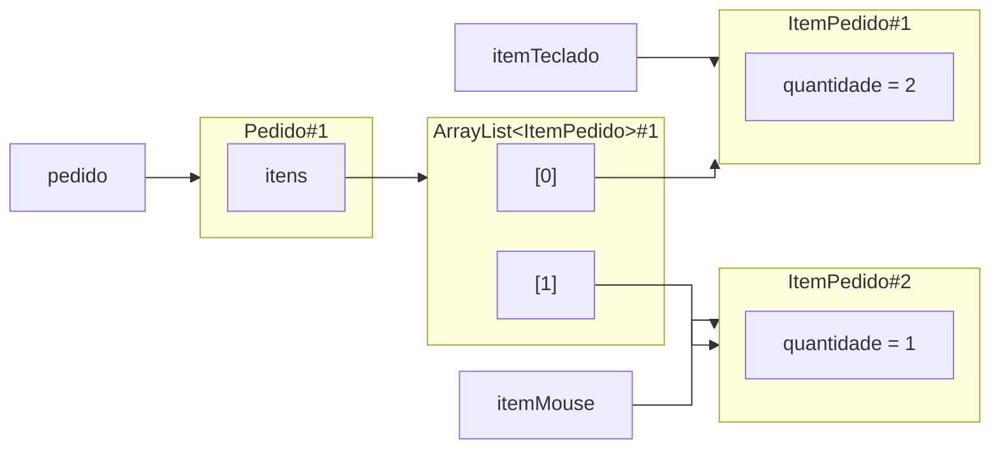
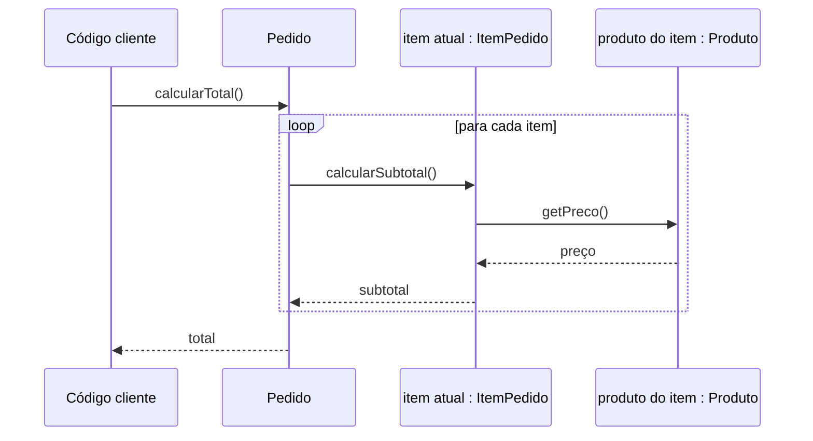

# Aula 07 — Um objeto coordenando vários outros

Na Aula 06, `ItemPedido` passou a colaborar com `Produto`: o item mantém sua quantidade e solicita ao produto o preço necessário para calcular o subtotal. Essa colaboração resolve um item isolado, mas um pedido real precisa reunir vários deles e coordenar o cálculo do total.

!!! lesson-question "Pergunta central"

    Como um objeto pode coordenar vários colaboradores sem assumir as responsabilidades deles?

!!! lesson-objectives "Objetivos"

    Ao final deste estudo, você deverá ser capaz de:

    - justificar por que `Pedido` deve manter os itens que o compõem;
    - representar uma quantidade variável de objetos com `List` e `ArrayList`;
    - explicar o que acontece com a referência quando um item é adicionado a uma coleção;
    - acompanhar um percurso sobre objetos com o `for` aprimorado;
    - explicar como `Pedido`, `ItemPedido` e `Produto` colaboram no cálculo do total;
    - distinguir coordenar colaboradores de refazer o trabalho que pertence a eles.

<!-- bloco-didatico: 7.1 | estimativa: 20–25 min -->

## Quem conhece os itens de um pedido?

Já conseguimos criar produtos e itens que colaboram:

```java
Produto teclado = new Produto("Teclado", 150.0);
Produto mouse = new Produto("Mouse", 80.0);

ItemPedido itemTeclado = new ItemPedido(teclado, 2);
ItemPedido itemMouse = new ItemPedido(mouse, 1);
```

Os dois itens existem, mas ainda não existe um objeto que represente o pedido ao qual eles pertencem. O cálculo pode ser improvisado em `Main`:

```java
double total = itemTeclado.calcularSubtotal()
             + itemMouse.calcularSubtotal();
```

Esse trecho produz `380.0`, mas depende de `Main` conhecer cada item e lembrar de incluí-lo no cálculo. Se um terceiro item entrar no pedido, o cálculo também precisará ser alterado. O problema não está na soma; está na ausência de um responsável pelo conjunto.

!!! activity "Atividade — onde está a responsabilidade que falta?"

    Considere três alternativas para manter os itens e calcular o total:

    1. `Produto`, porque fornece o preço;
    2. `Main`, porque cria os objetos;
    3. um novo objeto `Pedido`, porque representa o conjunto de itens.

    Para cada alternativa, identifique quais informações o objeto conhece e explique se a responsabilidade combina com aquilo que ele representa.

??? "Ver resposta"

    - **`Produto`:** conhece o preço, mas não representa o conjunto de itens.
    - **`Main`:** cria os objetos, mas não representa uma regra do domínio.
    - **`Pedido`:** representa o conjunto; deve manter os itens e coordenar o total, solicitando a cada `ItemPedido` seu subtotal.

`Produto` representa algo que pode participar de muitos pedidos. Ele não deve conhecer todos os itens em que aparece nem o pedido ao qual cada participação pertence.

`Main` pode montar um cenário e iniciar o programa, mas não representa um conceito do domínio. Se as regras do pedido ficarem espalhadas ali, outros pontos do sistema terão de conhecê-las e repeti-las.

`Pedido`, por outro lado, representa exatamente a unidade que reúne os itens. Ele é o candidato natural para:

- manter os itens que o compõem;
- receber novos itens;
- coordenar o cálculo do total.

Essa decisão não transfere ao pedido tudo o que os itens fazem. Cada `ItemPedido` continua responsável por seu subtotal. O novo objeto conhece o conjunto e coordena seus participantes.

!!! conceito-chave "Conceito-chave — objeto coordenador"

    Um objeto coordena colaboradores quando mantém o conjunto relevante e solicita a cada participante o comportamento necessário para cumprir uma responsabilidade do conjunto. Coordenar não significa copiar o estado nem refazer o trabalho dos colaboradores.

Uma primeira estrutura para a nova classe seria:

```java
public class Pedido {
    // precisa manter vários objetos ItemPedido
}
```

A responsabilidade está escolhida. Falta descobrir como representar uma quantidade de itens que pode variar de um pedido para outro.

<!-- bloco-didatico: 7.2 | estimativa: 30–35 min -->

## Como manter uma quantidade variável de itens?

Poderíamos declarar campos separados:

```java
private ItemPedido primeiroItem;
private ItemPedido segundoItem;
private ItemPedido terceiroItem;
```

Essa estrutura fixa antecipadamente quantos itens cabem no pedido. Também obriga cada operação a tratar os campos um por um. Um pedido com quatro itens exigiria mudar a classe.

O que precisamos é de um único campo capaz de manter várias referências para objetos do mesmo tipo. Em Java, podemos usar uma lista:

```java
import java.util.ArrayList;
import java.util.List;

public class Pedido {
    private List<ItemPedido> itens;

    public Pedido() {
        itens = new ArrayList<>();
    }
}
```

Agora todo `Pedido` nasce com uma lista vazia pronta para receber itens. Um pedido vazio é um estado inicial coerente nesta etapa do projeto: ele ainda não possui itens, e seu total será zero.

!!! java-focus "Java em foco — `List` e `ArrayList`"

    Em `List<ItemPedido>`, `List` indica uma coleção em sequência e `ItemPedido` indica o tipo de elemento que pretendemos manter nela.

    `new ArrayList<>()` cria o objeto concreto usado como lista. Os símbolos `<>` permitem que Java aproveite o tipo já declarado à esquerda. Para usar essas classes, importamos `java.util.List` e `java.util.ArrayList`.

    Neste momento, basta saber criar a lista, adicionar itens e percorrê-la. Os detalhes de Generics não são nosso objeto de estudo.

Podemos oferecer ao pedido uma operação para receber um item:

```java
public void adicionarItem(ItemPedido item) {
    itens.add(item);
}
```

O método expressa uma ação do domínio: adicionar um item ao pedido. Quem usa `Pedido` não precisa manipular diretamente sua lista interna.

Considere agora:

```java
Pedido pedido = new Pedido();
pedido.adicionarItem(itemTeclado);
pedido.adicionarItem(itemMouse);
```

Cada chamada a `adicionarItem` transmite uma referência já existente. `itens.add(item)` guarda essa referência na lista. Não aparece `new ItemPedido(...)` no método, portanto nenhum item novo é criado e nenhuma cópia automática é feita.



!!! activity "Atividade — acompanhe as referências"

    Depois das duas chamadas a `adicionarItem`, responda sem executar:

    1. quantos objetos `ItemPedido` foram criados pelas chamadas mostradas?
    2. a variável `itemTeclado` e o primeiro elemento da lista permitem chegar a qual objeto?
    3. alterar o estado de `itemTeclado` por uma operação pública seria percebido ao acessar o item pela lista? Por quê?
    4. o que aconteceria se `itemTeclado` fosse adicionado uma segunda vez?

??? "Ver resposta"

    1. As chamadas a `adicionarItem` não criam objetos; os dois `ItemPedido` já existiam.
    2. `itemTeclado` e o primeiro elemento da lista chegam à mesma identidade.
    3. Uma alteração feita por uma referência será observada pela outra, pois ambas apontam para o mesmo item.
    4. Se `itemTeclado` for adicionado novamente, duas posições da lista apontarão para a mesma identidade.

As chamadas não criam nenhum `ItemPedido`: elas guardam referências para os dois objetos que já existiam. Se o mesmo item for adicionado novamente, a lista terá duas posições apontando para a mesma identidade. A lista não impede isso automaticamente; decidir se a repetição deve ser aceita é uma regra de domínio que não precisamos acrescentar nesta etapa.

!!! trap "Armadilha — entregar a lista para qualquer código modificar"

    Um método como `public List<ItemPedido> getItens()` devolveria a referência para a coleção interna. Quem recebesse essa referência poderia adicionar ou remover elementos sem passar pelas operações de `Pedido`. Para o problema atual, ofereça comportamentos como `adicionarItem` e `calcularTotal`, preservando a responsabilidade do pedido sobre seu próprio estado.

A lista resolve como manter os colaboradores. Agora precisamos usá-los sem deslocar para `Pedido` aquilo que já pertence a `ItemPedido`.

<!-- bloco-didatico: 7.3 | estimativa: 30–35 min -->

## Como calcular o total sem refazer os subtotais?

O pedido possui uma quantidade variável de itens. Somar campos nomeados individualmente já não é uma opção. Precisamos percorrer a lista e pedir o subtotal de cada elemento:

```java
public double calcularTotal() {
    double total = 0.0;

    for (ItemPedido item : itens) {
        total += item.calcularSubtotal();
    }

    return total;
}
```

!!! java-focus "Java em foco — percorrendo uma lista com `for`"

    Em `for (ItemPedido item : itens)`, leia: “para cada `ItemPedido`, chamado temporariamente de `item`, presente em `itens`”.

    A cada repetição, `item` recebe uma referência para o próximo objeto da lista. O laço termina depois que todos os elementos forem percorridos.

Leia agora o fluxo completo de responsabilidades:

1. `pedido.calcularTotal()` inicia o total com zero;
2. `Pedido` percorre as referências mantidas em `itens`;
3. para cada referência, solicita `item.calcularSubtotal()`;
4. `ItemPedido` solicita `produto.getPreco()` e combina o preço com sua quantidade;
5. o subtotal retorna ao pedido e é acumulado;
6. depois do último item, `Pedido` devolve o total.



No cenário anterior:

- o item do teclado devolve `150.0 * 2 = 300.0`;
- o item do mouse devolve `80.0 * 1 = 80.0`;
- o pedido coordena as chamadas e devolve `380.0`.

!!! activity "Atividade — siga o fluxo das chamadas"

    Considere o pedido com os dois itens anteriores e responda:

    1. quantas vezes `ItemPedido.calcularSubtotal()` é chamado?
    2. quantas vezes `Produto.getPreco()` é chamado?
    3. qual objeto conhece a quantidade usada em cada multiplicação?
    4. qual objeto conhece o conjunto completo de subtotais que precisam ser somados?
    5. qual é o resultado de `new Pedido().calcularTotal()`?

??? "Ver resposta"

    1. `ItemPedido.calcularSubtotal()` é chamado duas vezes.
    2. `Produto.getPreco()` também é chamado duas vezes.
    3. Cada `ItemPedido` conhece a quantidade usada em sua multiplicação.
    4. `Pedido` conhece o conjunto de subtotais que precisam ser somados.
    5. `new Pedido().calcularTotal()` não entra no laço e devolve `0.0`.

Para dois itens, cada uma das duas operações é chamada duas vezes. Cada item conhece sua quantidade; cada produto fornece seu preço; somente o pedido conhece o conjunto de itens a percorrer. Em um pedido vazio, o laço não executa nenhuma repetição e o total permanece `0.0`.

### Coordenar não é fazer o trabalho dos colaboradores

Compare a solução anterior com esta alternativa:

```java
public double calcularTotal() {
    double total = 0.0;

    for (ItemPedido item : itens) {
        total += item.getProduto().getPreco()
               * item.getQuantidade();
    }

    return total;
}
```

Ela pode produzir o mesmo número, mas faz `Pedido` conhecer detalhes internos do cálculo de um subtotal: onde obter o preço e como combiná-lo com a quantidade. A regra passa a existir em dois lugares se `ItemPedido.calcularSubtotal()` continuar no modelo.

Na solução por colaboração, `Pedido` conhece apenas o comportamento de que precisa: cada item sabe calcular seu subtotal. Se essa regra mudar, o pedido não precisa aprender os novos detalhes.

!!! trap "Armadilha — coordenação que invade responsabilidades"

    Um coordenador precisa conhecer quais colaboradores participam e qual operação solicitar. Ele não deve acessar todo o estado deles para reproduzir uma regra que já pertence a cada colaborador.

### A mesma ideia em outro domínio

<!-- aprofundamento-elastico -->

Uma `Turma` reúne vários objetos `Aluno`. Cada aluno conhece suas próprias notas e a regra que determina sua aprovação. A turma precisa contar quantos alunos estão aprovados.

Sem implementar as classes, proponha:

1. qual objeto deve manter a lista de alunos;
2. qual operação a turma deve solicitar a cada aluno;
3. qual objeto percorre a coleção;
4. por que a turma não deveria recalcular diretamente a média de cada aluno.

??? "Ver resposta"

    1. `Turma` deve manter a lista de alunos.
    2. Para cada aluno, solicita `estaAprovado()`.
    3. A própria `Turma` percorre a coleção.
    4. `Turma` não acessa notas nem recalcula a média para decidir a aprovação. O estado e a regra de aprovação pertencem a `Aluno`; o papel da turma é coordenar os colaboradores e contar os resultados.

A estrutura se transfere sem depender de pedidos:

- `Pedido` percorre `ItemPedido` e solicita `calcularSubtotal()`;
- `Turma` percorre `Aluno` e solicita `estaAprovado()`.

Nos dois casos, o coordenador conhece o conjunto e organiza as chamadas, mas não absorve a responsabilidade de seus colaboradores.

## Fechando a trajetória

!!! synthesis "Síntese"

    Partimos de itens isolados e identificamos a responsabilidade que faltava no modelo:

    - `Pedido` mantém a coleção de itens que o compõem;
    - `List<ItemPedido>` expressa uma quantidade variável de referências;
    - `ArrayList` fornece o objeto concreto usado para armazená-las;
    - adicionar um item guarda uma referência existente, sem criar uma cópia;
    - `Pedido` percorre os itens e solicita o subtotal de cada um;
    - `ItemPedido` preserva o cálculo do subtotal e colabora com `Produto`;
    - coordenar significa organizar as chamadas do conjunto, não absorver as responsabilidades dos participantes.

O modelo agora representa um pedido com vários itens e calcula seu total. Essa estrutura será consolidada no próximo laboratório ao evoluir o Projeto 1.

## Material da aula

- [Aula 06 — Colaboração entre objetos](aula-06-colaboracao-entre-objetos.md)
- [Java essencial para quem já sabe programar](../materiais/java-essencial.md)
