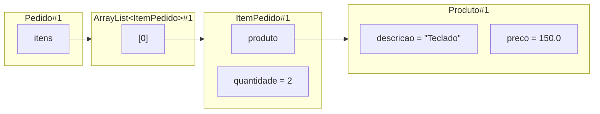

# Aula 08 — Relações entre objetos

Na Aula 07, o modelo passou a calcular o total de um pedido por colaboração:
`Pedido` reúne itens, cada `ItemPedido` calcula seu subtotal e cada `Produto`
fornece seu preço. O código já contém relações entre esses objetos. Agora vamos
torná-las explícitas para decidir quais delas são necessárias e quem deve
mantê-las.

**Slides:** [Apresentação HTML](../slides/rendered/aula-08-relacoes-entre-objetos.html) · [PDF](../slides/rendered/aula-08-relacoes-entre-objetos.pdf)

!!! lesson-question "Pergunta central"

    Quando um objeto precisa conhecer outro e quando essa relação faz parte da estrutura que ele deve manter?

!!! lesson-objectives "Objetivos"

    Ao final deste estudo, você deverá ser capaz de:

    - identificar quais objetos mantêm referências para quais outros;
    - explicar uma relação em termos da responsabilidade que ela permite cumprir;
    - reconhecer que uma relação pode ter apenas uma direção;
    - distinguir conhecer um colaborador de manter uma parte estrutural;
    - reconhecer uma composição simples como responsabilidade estrutural;
    - evitar relações adicionais que não resolvem uma responsabilidade do modelo.

<!-- bloco-didatico: 8.1 | estimativa: 25–30 min -->

## Que relações o modelo já possui?

O modelo atual foi construído passo a passo. Primeiro, `ItemPedido` recebeu um
`Produto` para obter o preço necessário ao subtotal. Depois, `Pedido` passou a
manter vários itens para coordenar o total.

```java
public class ItemPedido {
    private Produto produto;
    private int quantidade;

    public ItemPedido(Produto produto, int quantidade) {
        this.produto = produto;

        if (quantidade >= 0) {
            this.quantidade = quantidade;
        }
    }

    public double calcularSubtotal() {
        return produto.getPreco() * quantidade;
    }
}
```

```java
import java.util.ArrayList;
import java.util.List;

public class Pedido {
    private List<ItemPedido> itens;

    public Pedido() {
        itens = new ArrayList<>();
    }

    public void adicionarItem(ItemPedido item) {
        itens.add(item);
    }

    public double calcularTotal() {
        double total = 0.0;

        for (ItemPedido item : itens) {
            total += item.calcularSubtotal();
        }

        return total;
    }
}
```

Os campos `produto` e `itens` guardam referências. Eles mostram duas relações
que o modelo já precisa manter:

- um `ItemPedido` conhece o `Produto` de que precisa para calcular seu subtotal;
- um `Pedido` conhece os `ItemPedido` que reúne para coordenar o total.

Considere um pedido com um item de teclado. O diagrama mostra a estrutura
relevante depois que o item foi adicionado ao pedido. Não há variável externa
porque a pergunta agora é sobre as relações mantidas pelos próprios objetos.



!!! activity "Atividade — leia a direção das relações"

    Use somente o código e o diagrama anteriores para responder:

    1. qual campo permite a `ItemPedido` solicitar o preço?
    2. qual campo permite a `Pedido` encontrar os itens que devem participar do total?
    3. `Produto` precisa manter uma lista dos pedidos em que aparece para fornecer seu preço? Justifique pela responsabilidade atual de `Produto`.
    4. se outro item usar o mesmo teclado, quantos objetos `Produto` precisam existir?

??? "Ver resposta"

    1. O campo `produto` de `ItemPedido` permite chegar ao objeto que fornece `getPreco()`.
    2. O campo `itens` de `Pedido` permite chegar à coleção de referências para os itens do pedido.
    3. Não. A responsabilidade atual de `Produto` é manter e fornecer suas próprias informações, como preço. Ele não precisa conhecer o conjunto de pedidos para executar `getPreco()`.
    4. Apenas um `Produto` é suficiente. Vários `ItemPedido` podem manter referências para a mesma identidade de produto.

Uma relação não aparece porque duas classes existem no mesmo programa. Ela
aparece porque um objeto precisa alcançar outro para cumprir uma
responsabilidade. A direção importa: `ItemPedido` conhecer `Produto` não torna
necessário que `Produto` conheça esse item; `Pedido` conhecer seus itens não
obriga cada item a conhecer o pedido.

!!! conceito-chave "Conceito-chave — associação entre objetos"

    Há uma associação quando um objeto mantém uma referência para outro porque precisa colaborar com ele em alguma responsabilidade. A associação tem direção: dizer que A conhece B não diz, por si só, que B conhece A.

No modelo atual, `ItemPedido` está associado a `Produto`, e `Pedido` está
associado aos itens que reúne. O nome ajuda a recuperar a ideia, mas a pergunta
principal continua sendo: **que responsabilidade torna essa referência necessária?**

<!-- bloco-didatico: 8.2 | estimativa: 25–30 min -->

## Quais relações formam a estrutura do pedido?

As duas associações anteriores não possuem o mesmo papel. Um produto existe no
catálogo mesmo quando não participa de nenhum pedido. Ele pode aparecer em
itens de pedidos diferentes sem deixar de ser o mesmo produto.

Um `ItemPedido`, por sua vez, representa uma participação de um produto em um
pedido: sua quantidade só ganha esse significado dentro daquele conjunto. Por
isso, `Pedido` não apenas consulta itens ocasionalmente; ele mantém a estrutura
formada por eles, recebe-os pela operação `adicionarItem` e usa-os para calcular
o total.

Essa diferença pode ser organizada assim:

| Relação | Por que ela existe? | Quem mantém a estrutura? |
| --- | --- | --- |
| `ItemPedido` → `Produto` | o item precisa solicitar o preço que pertence ao produto | cada item mantém a referência para o produto usado no seu subtotal |
| `Pedido` → `ItemPedido` | o pedido precisa reunir os itens que o compõem e coordenar o total | o pedido mantém sua coleção de itens |

No código atual, um item pode ser criado antes de ser adicionado ao pedido. Essa
ordem de construção é uma conveniência para montar o cenário em `Main`; ela não
altera o papel conceitual do item. No modelo do domínio, o item representa uma
parte de um pedido, enquanto o produto pode existir independentemente dele.

!!! activity "Atividade — o que muda quando o pedido deixa de conhecer seus itens?"

    Imagine que o campo `itens` seja removido de `Pedido`, mas que `Produto` e `ItemPedido` permaneçam como estão.

    1. qual objeto passaria a ter de conhecer todos os itens para somar os subtotais?
    2. por que essa alternativa enfraquece a ideia de que `Pedido` representa o conjunto?
    3. o que `Produto` perderia se nenhum pedido o utilizasse por enquanto?

??? "Ver resposta"

    1. Algum código cliente, como `Main`, teria de conhecer cada item e somar os subtotais manualmente.
    2. A regra do conjunto ficaria fora do objeto que representa o pedido. Cada novo ponto do programa precisaria lembrar quais itens participam e como obter o total.
    3. `Produto` não perderia seu próprio significado: ainda poderia manter descrição e preço no catálogo, mesmo sem participar de um pedido naquele instante.

Quando um objeto representa um todo e é responsável por manter as partes que
formam sua estrutura, chamamos essa relação de **composição**. Aqui, `Pedido`
é o todo e seus `ItemPedido` são partes estruturais. Isso não é uma regra sobre
como Java libera memória, nem exige decorar símbolos de diagramas: é uma forma
de explicar por que o pedido deve manter e controlar esse conjunto.

!!! conceito-chave "Conceito-chave — composição como responsabilidade estrutural"

    Composição é uma relação em que um objeto representa o todo e assume a responsabilidade de manter partes que compõem sua estrutura. As partes têm sentido no modelo por participarem desse todo.

`Produto` não é uma parte estrutural de um único pedido: pode existir antes,
depois ou fora de qualquer pedido. Já o item expressa a presença de um produto
em um pedido específico. Essa análise de ciclo de vida é conceitual: ela ajuda
a decidir quem deve manter a relação.

### Manter a relação também exige encapsulamento

Se `Pedido` é responsável por seus itens, código externo não deve receber a
própria lista interna para modificá-la livremente. Por isso o modelo oferece
uma operação como `adicionarItem(item)` em vez de um getter que devolve
`itens`.

O objeto que mantém a estrutura também controla as portas de entrada para essa
estrutura. Nesta etapa, só precisamos adicionar e calcular o total. Regras
como remoção, repetição de itens ou fechamento do pedido serão decisões
posteriores, quando houver um problema concreto que as exija.

<!-- bloco-didatico: 8.3 | estimativa: 25–30 min -->

## Toda relação reversa ajuda o modelo?

Depois de perceber que um item conhece seu produto, alguém pode propor que o
produto também guarde todos os pedidos em que aparece:

```java
import java.util.List;

public class Produto {
    private String descricao;
    private double preco;
    private List<Pedido> pedidos;

    // demais operações
}
```

O campo acima acrescenta uma relação de `Produto` para `Pedido`. Ele não é
automaticamente um erro de Java, mas precisamos perguntar qual responsabilidade
o exige. No modelo atual, o preço é fornecido por `getPreco()` e o total é
coordenado por `Pedido`. Nenhuma dessas operações precisa que o produto percorra
pedidos.

Adicionar a referência sem uma necessidade faz `Produto` conhecer uma parte do
sistema que não precisa para cumprir sua responsabilidade. Também cria novas
perguntas: quem adiciona um pedido nessa lista, em que momento, e como impedir
que a relação seja atualizada de um lado e esquecida do outro? Essas perguntas
não são motivo para criar regras novas agora; elas mostram o custo de adicionar
conhecimento sem necessidade.

!!! activity "Atividade — compare duas direções"

    Compare as duas decisões abaixo para o modelo atual:

    - **A.** `Pedido` mantém itens e cada item mantém seu produto.
    - **B.** Além disso, cada produto mantém todos os pedidos em que aparece.

    1. qual responsabilidade atual exige a relação adicional da decisão B?
    2. qual decisão permite calcular o total sem fazer `Produto` conhecer pedidos?
    3. em que situação futura uma relação de produto para pedidos poderia ser discutida sem ser automaticamente inadequada?

??? "Ver resposta"

    1. Nenhuma das responsabilidades atuais a exige. `Produto` fornece preço; `ItemPedido` calcula subtotal; `Pedido` coordena total.
    2. A decisão A já é suficiente: o pedido percorre seus itens e solicita os subtotais.
    3. Seria preciso surgir uma responsabilidade concreta que dependesse de um produto alcançar seus pedidos, como uma consulta definida pelo domínio. Antes disso, a relação acrescenta conhecimento e manutenção sem benefício para o problema atual.

Quando `Pedido` chama `item.calcularSubtotal()`, ele depende desse
comportamento de `ItemPedido`. Quando o item chama `produto.getPreco()`, ele
depende dessa informação de `Produto`. Essa é uma noção inicial de
**dependência**: para realizar uma responsabilidade, um objeto precisa que
outro forneça uma operação ou informação. Não precisamos, por enquanto,
introduzir interfaces nem outras formas de variar essa colaboração.

!!! trap "Armadilha — espelhar toda relação"

    Uma referência de A para B não deve ser duplicada em B apenas para tornar o diagrama simétrico. Acrescente a direção inversa somente quando B também possuir uma responsabilidade que exija alcançar A.

### A mesma análise em uma biblioteca

<!-- aprofundamento-elastico -->

Uma biblioteca empresta livros a usuários. `Livro` mantém título e autor;
`Usuario` mantém seu nome. Quando um empréstimo é registrado, um objeto
`Emprestimo` guarda o livro, o usuário e a data prevista para devolução. A
`Biblioteca` mantém os empréstimos que estão ativos.

No primeiro recorte do problema, a biblioteca precisa registrar empréstimos e
consultar quais estão ativos. Começamos por essa estrutura mínima antes de
decidir se livro ou usuário também precisam alcançar empréstimos.

Sem implementar as classes completas, proponha respostas para estas perguntas:

1. quais informações pertencem a `Livro` e quais pertencem a `Usuario`?
2. quais objetos `Emprestimo` precisa conhecer para representar uma retirada?
3. qual objeto deve manter o conjunto de empréstimos ativos?
4. qual relação parece estrutural: `Biblioteca` → `Emprestimo`, `Emprestimo` → `Livro` ou `Emprestimo` → `Usuario`?
5. por que `Livro` e `Usuario` não precisam, por enquanto, manter listas de empréstimos?

??? "Ver resposta"

    1. Título e autor pertencem a `Livro`; nome pertence a `Usuario`. Essas informações continuam fazendo sentido sem um empréstimo ativo.
    2. `Emprestimo` precisa conhecer o `Livro` retirado e o `Usuario` que o retirou. Também mantém a data prevista para devolução, que descreve aquele empréstimo.
    3. `Biblioteca` deve manter o conjunto de empréstimos ativos, pois representa o local que os registra e consulta.
    4. `Biblioteca` → `Emprestimo` parece estrutural: os empréstimos ativos formam uma estrutura que a biblioteca mantém. `Emprestimo` → `Livro` e `Emprestimo` → `Usuario` são associações necessárias para identificar os participantes daquele registro.
    5. Fornecer título e autor, ou o nome de um usuário, não exige alcançar empréstimos. No recorte atual, a biblioteca já possui o conjunto necessário para registrá-los e consultá-los. Uma lista em `Livro` ou `Usuario` só faria sentido diante de uma responsabilidade que a exigisse.

O novo domínio exige olhar para duas associações — empréstimo com livro e com
usuário — e para uma estrutura mantida pela biblioteca. A resposta não está no
nome das classes: ela depende de identificar quem possui a informação, quem
precisa colaborar e quem mantém o conjunto.

### Quando uma pergunta nova muda as relações?

Agora suponha que a biblioteca receba novas responsabilidades:

- registrar a devolução de um empréstimo;
- informar quantos empréstimos **ativos** um usuário possui;
- informar quantos empréstimos um usuário já realizou ao longo do tempo;
- mostrar as retiradas anteriores de um livro.

Essas perguntas não têm todas a mesma consequência. Elas servem para testar se
uma relação adicional resolve uma responsabilidade real ou apenas cria um
atalho aparente.

!!! activity "Atividade — novas responsabilidades, novas decisões"

    Analise as quatro responsabilidades acima.

    1. quem deve coordenar a devolução de um empréstimo ativo? Por quê?
    2. para contar os empréstimos ativos de um usuário, é obrigatório que `Usuario` mantenha sua própria lista? Que objeto já possui os registros necessários?
    3. se a devolução fizer o empréstimo deixar o conjunto de ativos, por que esse conjunto não basta para contar todos os empréstimos que o usuário já realizou?
    4. uma lista de empréstimos em `Livro` ou em `Usuario` seria sempre uma boa solução para consultar histórico? Que responsabilidade e que custo de manutenção precisariam ser esclarecidos antes?

??? "Ver resposta"

    1. `Biblioteca` deve coordenar a devolução porque mantém o conjunto de empréstimos ativos. A forma precisa de encerrar ou retirar o registro será uma regra posterior; o ponto atual é que quem mantém a estrutura controla essa mudança.
    2. Não. `Biblioteca` já mantém os empréstimos ativos e pode consultar nesse conjunto quantos se referem ao usuário. Uma operação como `quantidadeEmprestimosAtivosDe(usuario)` expressaria essa consulta sem obrigar `Usuario` a guardar uma segunda lista.
    3. Depois que um empréstimo deixa de estar ativo, ele não aparece mais nessa coleção. Para responder sobre todo o passado, o modelo precisaria decidir se e onde preserva registros encerrados. A necessidade revela uma decisão nova de estrutura e ciclo de vida.
    4. Não necessariamente. Uma lista poderia ser justificada se o próprio livro ou usuário precisasse navegar por seus empréstimos para cumprir uma responsabilidade definida. Mas ela também cria uma relação que precisa ser atualizada junto com a biblioteca. Antes de acrescentá-la, é preciso explicar qual consulta ela permite e quem manterá os dois lados coerentes.

Uma pergunta nova pode justificar rever o modelo, mas não determina sozinha uma
lista em cada classe. Contar empréstimos ativos é uma consulta que a
`Biblioteca` já pode realizar sobre sua estrutura. Guardar histórico, por sua
vez, mostra que a estrutura atual não contém mais toda a informação necessária.
É a responsabilidade desejada — e não a vontade de deixar as relações
simétricas — que orienta a próxima decisão.

## Fechando a trajetória

!!! synthesis "Síntese"

    O modelo de pedidos já continha relações; agora podemos explicá-las pelas responsabilidades que elas permitem cumprir:

    - `ItemPedido` conhece `Produto` para solicitar o preço necessário ao subtotal;
    - `Pedido` conhece seus itens porque representa e mantém o conjunto que coordena;
    - conhecer outro objeto não exige que a relação exista no sentido inverso;
    - `Pedido` e `ItemPedido` formam uma composição conceitual, enquanto `Produto` pode existir independentemente do pedido;
    - a coleção permanece encapsulada porque o pedido é responsável por sua estrutura;
    - uma dependência aparece quando um objeto precisa da operação de outro para realizar sua própria responsabilidade.

Na próxima etapa, poderemos evoluir regras de `Pedido` sem perder de vista onde
cada relação está e quem deve proteger a estrutura que elas formam.

## Material da aula

- [Aula 07 — Um objeto coordenando vários outros](aula-07-um-objeto-coordenando-varios-outros.md)
- [Laboratório 07 — Coordenando itens em um pedido](laboratorio-07-coordenando-itens-em-um-pedido.md)
- [Java essencial para quem já sabe programar](../materiais/java-essencial.md)
