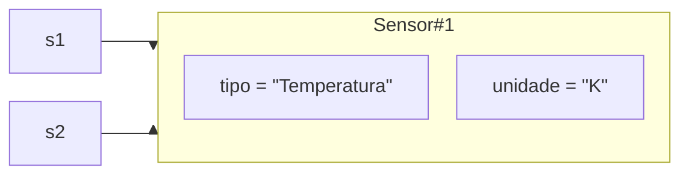
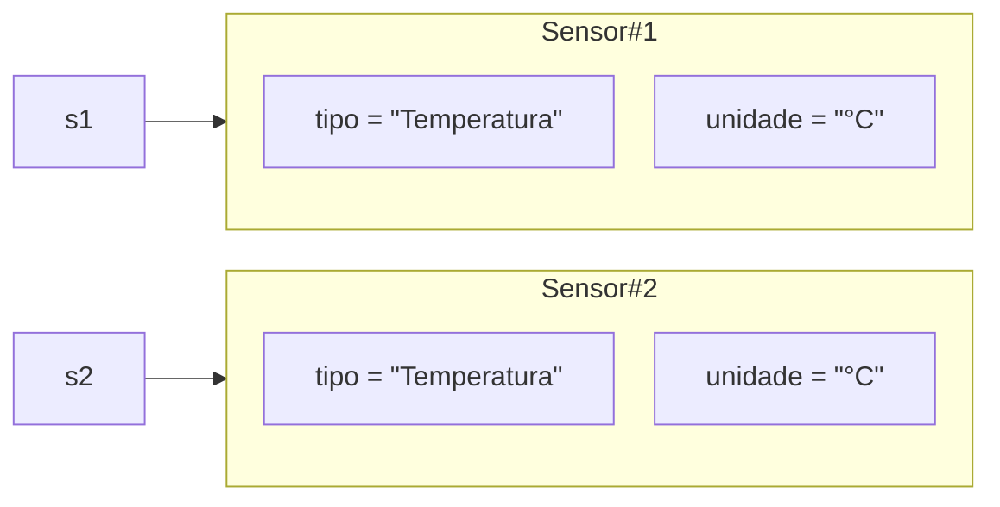
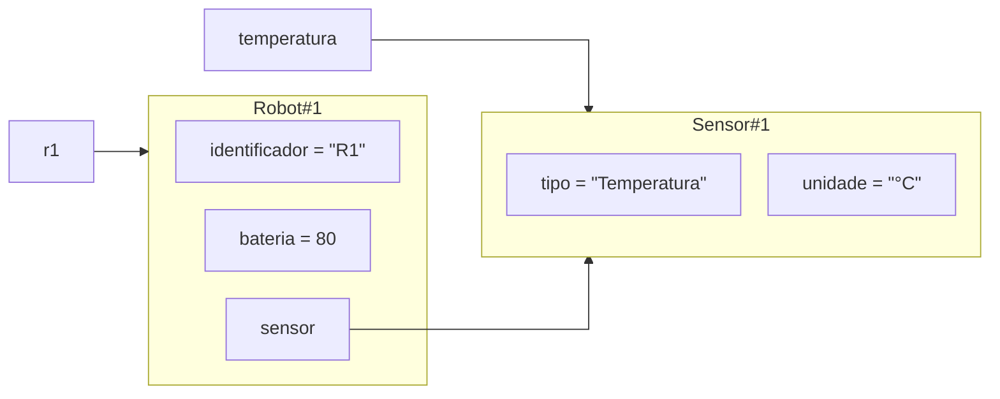
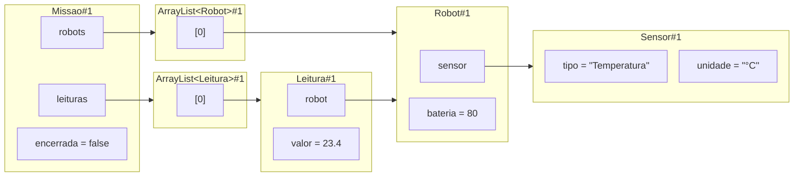

# Aula 11 — Revisão da Unidade 01

**Um problema novo, as mesmas ideias**

Nesta revisão, não vamos percorrer uma lista de definições. Vamos construir um
sistema que ainda não conhecemos e usar cada nova necessidade para recuperar o
raciocínio desenvolvido nas Aulas 02–10.

**Slides:** [Apresentação HTML](../slides/rendered/aula-11-revisao-da-unidade-01.html) · [PDF](../slides/rendered/aula-11-revisao-da-unidade-01.pdf)

!!! lesson-question "Pergunta central"

    Se você receber um sistema que nunca viu, consegue descobrir quais objetos
    existem, quem é responsável pelo quê, quem conhece quem, qual estado muda e
    por que o sistema se comporta daquela maneira?

!!! lesson-objectives "Objetivos"

    Ao final deste estudo, você deverá ser capaz de:

    - reconstruir um modelo de objetos a partir de responsabilidades e regras;
    - prever efeitos de criação, referências compartilhadas e identidade;
    - justificar relações, colaborações, coleções e composição;
    - localizar o objeto que deve proteger cada mudança de estado; e
    - explicar execuções integradas sem depender de um domínio já conhecido.

<!-- bloco-didatico: 11.1 -->

## Uma missão, ainda sem classes

Uma equipe utiliza robôs para investigar uma região. Cada robô possui uma
identificação, uma bateria e utiliza um sensor para realizar observações. Uma
missão reúne determinados robôs e preserva as leituras registradas durante a
exploração.

Enquanto a missão está aberta, a equipe e os registros podem mudar. Depois que
ela é encerrada, sua estrutura e seus registros devem permanecer como estavam.

Antes de escrever Java, observe o problema.

1. Que coisas talvez precisem manter estado próprio?
2. Que comportamentos já conseguimos enxergar?
3. Qual substantivo do enunciado não precisa necessariamente virar classe?
4. Que responsabilidade não deveria ficar espalhada em `Main`?

??? "Ver uma análise possível"

    1. Sensor, robô, leitura e missão são candidatos porque podem ter estado e
       responsabilidades próprias.
    2. Criar uma observação, reunir participantes, registrar leituras, trocar um
       sensor e encerrar uma missão são comportamentos possíveis.
    3. `Equipe` ou `região`, por exemplo, não precisam virar classes neste
       recorte se nenhuma responsabilidade exigir objetos próprios.
    4. Manter participantes, registros e a regra de encerramento combina com o
       objeto que representa a missão, não com `Main`.

O nome de uma coisa é apenas uma pista. Uma classe se justifica pelo papel que
seus objetos terão na solução: estado próprio, comportamento ou participação
necessária em uma colaboração.

## A primeira necessidade concreta

Para descrever um sensor, precisamos saber o que ele observa e a unidade usada:

```java
Sensor temperatura =
    new Sensor("Temperatura", "°C");
```

Essa linha já reúne várias decisões. `Sensor` define um tipo de objeto;
`temperatura` é uma variável; `new` cria uma nova identidade; os argumentos
fornecem os dados necessários para o estado inicial.

Compare com uma criação vazia:

```java
Sensor sensor = new Sensor();
sensor.tipo = "Temperatura";
sensor.unidade = "°C";
```

1. Em que momento o objeto passa a representar um sensor utilizável?
2. O que poderia acontecer se ele fosse enviado a outro objeto logo após o
   `new`?
3. Que valores os campos teriam antes das atribuições?

??? "Ver resposta"

    1. Na sequência vazia, somente depois das duas atribuições. Com o construtor
       completo, a criação já termina com os dados necessários.
    2. O objeto poderia circular incompleto e ser usado antes da preparação.
    3. Como `String` é tipo de referência, os dois campos começariam com
       `null`.

Uma primeira versão coerente é:

```java
public class Sensor {
    private String tipo;
    private String unidade;

    public Sensor(String tipo, String unidade) {
        this.tipo = tipo;
        this.unidade = unidade;
    }

    public String getTipo() {
        return tipo;
    }

    public String getUnidade() {
        return unidade;
    }
}
```

Na chamada, `"Temperatura"` é argumento. No construtor, `tipo` é parâmetro.
`this.tipo` é o campo do objeto atual. O caminho é:

```text
argumento → parâmetro → campo
```

## Uma variável nova cria outro sensor?

Considere:

```java
Sensor s1 = new Sensor("Temperatura", "°C");
Sensor s2 = s1;

// somente nesta versão exploratória, o campo está exposto
s2.unidade = "K";
```

Antes de continuar, responda:

1. Quantas variáveis existem?
2. Quantos objetos `Sensor` existem?
3. O que foi copiado para `s2`?
4. Que unidade será observada por `s1`, e o que `s1 == s2` produz?

??? "Ver resposta"

    1. Duas variáveis: `s1` e `s2`.
    2. Um objeto, porque há uma única execução de `new Sensor(...)`.
    3. Foi copiada a referência que permite chegar ao objeto.
    4. `s1` observa `"K"`, e a comparação produz `true`, pois as duas
       referências chegam à mesma identidade. A escrita direta existe apenas
       nesta versão exploratória; o modelo final mantém o campo privado.



Agora mude somente a segunda linha:

```java
Sensor s1 = new Sensor("Temperatura", "°C");
Sensor s2 = new Sensor("Temperatura", "°C");
```

1. Os dois objetos possuem o mesmo estado observado?
2. Eles possuem a mesma identidade?
3. O que `s1 == s2` produz?
4. Qual trecho prova que existe outra identidade?

??? "Ver resposta"

    1. Sim. Tipo e unidade possuem os mesmos valores.
    2. Não. Cada execução de `new` criou um objeto distinto.
    3. `false`.
    4. A segunda expressão `new Sensor(...)`.



Mesmos valores não eliminam as duas criações. Estado e identidade respondem a
perguntas diferentes.

## Surge um robô

Um sensor sozinho não explora uma região. Agora aparece um robô:

```java
Sensor temperatura =
    new Sensor("Temperatura", "°C");

Robot r1 =
    new Robot("R1", 80, temperatura);
```

O robô mantém identificação, bateria e uma referência para seu sensor atual:

```java
public class Robot {
    private String identificador;
    private int bateria;
    private Sensor sensor;

    public Robot(String identificador,
                 int bateria,
                 Sensor sensor) {
        this.identificador = identificador;
        this.sensor = sensor;

        if (bateria >= 0 && bateria <= 100) {
            this.bateria = bateria;
        }
    }

    // operações aparecem conforme as necessidades
}
```

1. Quantos objetos do nosso modelo as duas instruções criaram?
2. O robô contém uma cópia do sensor?
3. Quem conhece quem neste momento?
4. O sensor precisa conhecer o robô para fornecer tipo e unidade?

??? "Ver resposta"

    1. Dois: um `Sensor` e um `Robot`.
    2. Não. O argumento transmite uma referência para o sensor já existente.
    3. `Robot` conhece `Sensor` por seu campo. A variável `temperatura` também
       alcança o mesmo sensor.
    4. Não. Sua responsabilidade atual não exige a relação inversa.



## O Java aceita qualquer bateria inteira

Com o campo exposto, seria possível escrever:

```java
robot.bateria = -20;
```

O valor cabe em um `int`, mas não representa a bateria que aceitamos no
domínio. Tornar o campo privado impede a escrita direta; ainda precisamos
oferecer operações que expressem mudanças válidas.

```java
public int getBateria() {
    return bateria;
}

public void deslocar(int consumo) {
    if (consumo > 0 && consumo <= bateria) {
        bateria -= consumo;
    }
}
```

Considere bateria inicial `80`:

```java
robot.deslocar(15);
robot.deslocar(100);
```

1. Qual operação muda o estado?
2. Qual tentativa preserva o estado?
3. Qual é a bateria final?
4. Um `setBateria(int valor)` que apenas copia o argumento protegeria a regra?

??? "Ver resposta"

    1. `deslocar(15)` reduz a bateria para `65`.
    2. `deslocar(100)` é recusado porque o consumo não cabe na bateria atual.
    3. `65`.
    4. Não. Um setter irrestrito apenas mudaria a sintaxe e continuaria
       permitindo `-20` ou `150`.

!!! conceito-chave "Conceito-chave — encapsulamento reaplicado"

    Encapsular é fazer o objeto controlar as mudanças de seu estado por
    operações que expressem intenções e preservem regras. Não é gerar getters e
    setters automaticamente.

<!-- bloco-didatico: 11.2 -->

## Uma observação precisa virar registro

O robô consegue observar um valor. Agora precisamos preservar o acontecimento:

```java
Leitura leitura = r1.realizarLeitura(23.4);
```

Antes de decidir a implementação, pergunte:

1. Quem possui o sensor necessário para produzir a leitura?
2. Quais informações precisam permanecer no registro?
3. A leitura precisa conhecer o sensor atual para sempre?
4. O robô precisa guardar todas as leituras que já produziu?

??? "Ver uma decisão coerente"

    1. `Robot` conhece o sensor atual e pode criar o registro.
    2. Valor, tipo, unidade e origem da observação são suficientes neste modelo.
    3. Não. Guardar tipo e unidade observados preserva o significado do registro
       mesmo se o robô trocar de sensor depois.
    4. Não. A responsabilidade de manter os registros surgirá em `Missao`.

Uma solução simples é:

```java
public class Leitura {
    private Robot robot;
    private String tipoSensor;
    private String unidade;
    private double valor;

    public Leitura(Robot robot,
                   String tipoSensor,
                   String unidade,
                   double valor) {
        this.robot = robot;
        this.tipoSensor = tipoSensor;
        this.unidade = unidade;
        this.valor = valor;
    }

    public boolean foiRealizadaPor(Robot robot) {
        return this.robot == robot;
    }

    public String descrever() {
        return robot.getIdentificador() + ": "
            + tipoSensor + " = " + valor + " " + unidade;
    }
}
```

O robô colabora com o sensor para criar o registro:

```java
public Leitura realizarLeitura(double valor) {
    return new Leitura(
        this,
        sensor.getTipo(),
        sensor.getUnidade(),
        valor
    );
}
```

`Robot` sabe qual sensor está instalado; `Sensor` fornece tipo e unidade;
`Leitura` preserva o resultado e sua origem. Nenhum participante precisa
absorver todo o trabalho.

## Uma troca torna as referências observáveis

O robô pode trocar o próprio sensor:

```java
public void trocarSensor(Sensor novoSensor) {
    sensor = novoSensor;
}

public boolean usaSensor(Sensor sensor) {
    return this.sensor == sensor;
}
```

Considere:

```java
Sensor original = new Sensor("Temperatura", "°C");
Robot robot = new Robot("R1", 80, original);

Sensor apoio = original;
Sensor novoSensor = new Sensor("Umidade", "%");

robot.trocarSensor(novoSensor);
```

1. `original == apoio` continua verdadeiro?
2. `robot.usaSensor(original)` produz qual valor?
3. Quantos sensores existem?
4. Trocar o campo do robô alterou a identidade guardada em `apoio`?

??? "Ver resposta"

    1. Sim. As duas variáveis ainda apontam para `Sensor#1`.
    2. `false`: o campo do robô passou a apontar para `Sensor#2`.
    3. Dois, criados pelas duas execuções de `new Sensor(...)`.
    4. Não. A operação mudou a referência armazenada no robô; não modificou as
       variáveis externas nem transformou um sensor no outro.

Uma leitura criada antes da troca conserva o tipo e a unidade observados. A
troca afeta as próximas leituras, não reinterpreta os registros anteriores.

## Agora existe uma missão

Vários robôs precisam participar da mesma exploração:

```java
Missao missao = new Missao("Vale Norte");

missao.adicionarRobot(r1);
missao.adicionarRobot(r2);
```

1. Quem deve manter os participantes?
2. `Main` deveria guardar a lista e decidir todas as mudanças?
3. Cada robô precisa manter uma lista de missões?
4. A missão precisa conhecer os sensores diretamente?

??? "Ver resposta"

    1. `Missao`, porque representa e coordena a equipe da exploração.
    2. Não. `Main` monta o cenário, mas não representa a regra do conjunto.
    3. Não para as responsabilidades atuais. A relação inversa não é necessária.
    4. Não. A missão alcança o comportamento necessário por meio dos robôs.

Uma missão nasce com duas coleções vazias e estado aberto:

```java
import java.util.ArrayList;
import java.util.List;

public class Missao {
    private String nome;
    private List<Robot> robots;
    private List<Leitura> leituras;
    private boolean encerrada;

    public Missao(String nome) {
        this.nome = nome;
        robots = new ArrayList<>();
        leituras = new ArrayList<>();
        encerrada = false;
    }
}
```

Uma lista mantém referências. Adicionar um robô existente não cria nem copia o
objeto:

```java
public void adicionarRobot(Robot robot) {
    if (!encerrada && !participa(robot)) {
        robots.add(robot);
    }
}
```

```java
private boolean participa(Robot procurado) {
    for (Robot robot : robots) {
        if (robot == procurado) {
            return true;
        }
    }
    return false;
}
```

O `for` aprimorado percorre referências mantidas na coleção. A variável
temporária `robot` recebe, a cada repetição, a referência do próximo elemento.

## Registrar exige mais do que chamar o robô

Queremos usar:

```java
missao.registrarLeitura(r1, 23.4);
```

Antes da implementação:

1. A missão deve aceitar leitura de qualquer robô?
2. Como ela sabe se o robô participa?
3. Quem deve criar a `Leitura`?
4. A missão precisa acessar diretamente o campo `sensor`?
5. Em que ordem devemos verificar, criar e guardar?

??? "Ver resposta"

    1. Não. Nesta versão, somente participantes podem registrar.
    2. Percorrendo a coleção e comparando a referência procurada.
    3. `Robot` cria porque conhece o sensor e representa quem realizou a ação.
    4. Não. Ela solicita `robot.realizarLeitura(valor)`.
    5. Primeiro verificar as regras; depois criar; por último guardar o registro.

```java
public void registrarLeitura(Robot robot, double valor) {
    if (!encerrada && participa(robot)) {
        Leitura leitura = robot.realizarLeitura(valor);
        leituras.add(leitura);
    }
}
```

`Missao` coordena a regra e a coleção. `Robot` continua responsável por produzir
o registro com o contexto de seu sensor.

## Quem conhece quem?

Depois de registrar uma leitura, as relações mantidas pelos objetos podem ser
representadas assim:



Analise cada seta:

1. Que responsabilidade exige `Robot → Sensor`?
2. Por que `Leitura → Robot` existe?
3. `Robot` precisa conhecer `Missao`?
4. `Sensor` precisa conhecer todas as leituras que ajudou a produzir?
5. Qual relação reversa poderíamos acrescentar, mas não precisamos?

??? "Ver resposta"

    1. O robô usa o sensor atual para produzir observações e pode substituí-lo.
    2. O registro preserva a identidade de quem realizou a observação.
    3. Não. A missão verifica suas próprias regras antes de solicitar o
       comportamento do robô.
    4. Não. Fornecer tipo e unidade não exige manter histórico.
    5. Robot para missão, sensor para robô ou robô para leituras seriam relações
       extras sem responsabilidade atual que as justificasse.

!!! conceito-chave "Conceito-chave — relação necessária"

    Uma relação existe para permitir uma responsabilidade. A direção inversa
    não aparece automaticamente: conhecimento adicional também precisa ser
    criado, atualizado e mantido coerente.

## Associação e composição não são sinônimos

As três relações abaixo não têm o mesmo papel:

| Relação | Papel no modelo |
| --- | --- |
| `Missao → Robot` | associação com participantes que existem independentemente |
| `Robot → Sensor` | componente da configuração atual mantida pelo robô |
| `Missao → Leitura` | registro estrutural produzido e preservado pela missão |

Composição não significa apenas “um objeto possui outro”. Ela aparece quando um
objeto representa o todo e assume a responsabilidade por partes que formam sua
estrutura. Neste recorte, leituras compõem o registro da missão; robôs apenas
participam dela.

<!-- bloco-didatico: 11.3 -->

## A missão pode ser encerrada

O requisito agora é explícito:

> Depois de encerrada, a missão não recebe nem remove participantes, não troca
> sensores pela operação da missão e não registra novas leituras. Os registros
> existentes permanecem.

```java
public void encerrar() {
    encerrada = true;
}
```

1. Quem deve manter o estado aberto/encerrado?
2. Por que `Main` não deve lembrar a regra por todos os clientes?
3. O robô precisa conhecer a missão para decidir se pode produzir uma leitura?
4. Encerrar deve apagar registros antigos?

??? "Ver resposta"

    1. Cada objeto `Missao` mantém seu próprio `boolean encerrada`.
    2. Clientes diferentes poderiam esquecer a verificação; a missão controla
       suas operações e coleções.
    3. Não. A missão verifica antes de solicitar `realizarLeitura`.
    4. Não. Encerrar preserva a estrutura e os registros existentes.

Duas missões continuam independentes:

```java
Missao norte = new Missao("Vale Norte");
Missao sul = new Missao("Vale Sul");

norte.encerrar();
sul.adicionarRobot(r1);
```

Encerrar `norte` não altera o campo `encerrada` nem as listas de `sul`. Estado
de instância pertence a cada objeto.

## A ordem da verificação também conta objetos

Considere uma missão encerrada:

```java
missao.registrarLeitura(r1, 25.0);
```

Se criássemos a leitura antes de testar `encerrada`, surgiria um objeto que não
seria guardado. Na implementação adotada, a guarda envolve a chamada que cria:

```java
if (!encerrada && participa(robot)) {
    Leitura leitura = robot.realizarLeitura(valor);
    leituras.add(leitura);
}
```

1. Quantas `Leitura` são criadas por uma tentativa após o encerramento?
2. Qual estado da missão muda?
3. Que regra explica as duas respostas?

??? "Ver resposta"

    1. Nenhuma.
    2. Nenhum: participantes e registros permanecem iguais.
    3. A verificação acontece antes da criação e da inclusão.

## Remover um participante sem entregar a lista

O cliente solicita:

```java
missao.removerRobot(r1);
```

Não oferecemos `getRobots()` para que `Main` chame `remove()`. A lista é estado
interno da missão e suas mudanças precisam respeitar o encerramento.

```java
public void removerRobot(Robot procurado) {
    if (!encerrada) {
        for (int indice = 0; indice < robots.size(); indice++) {
            if (robots.get(indice) == procurado) {
                robots.remove(indice);
                return;
            }
        }
    }
}
```

1. Quem localiza o robô?
2. O robô deveria remover a si mesmo?
3. O que acontece se a missão estiver encerrada?
4. Remover um participante apaga leituras anteriores dele?

??? "Ver resposta"

    1. `Missao`, porque mantém a coleção.
    2. Não. O robô não conhece a missão nem sua lista.
    3. A guarda impede o percurso e preserva a coleção.
    4. Não. A coleção de registros é distinta e preserva o histórico já aceito.

## Localizar é diferente de alterar a parte

Antes do encerramento, pode ser necessário trocar o sensor de um participante:

```java
missao.trocarSensor(r1, umidade);
```

```java
public void trocarSensor(Robot procurado,
                         Sensor novoSensor) {
    if (!encerrada) {
        for (Robot robot : robots) {
            if (robot == procurado) {
                robot.trocarSensor(novoSensor);
                return;
            }
        }
    }
}
```

`Missao` localiza o participante e decide se a operação é permitida. O
`Robot` encontrado altera o campo que pertence ao seu próprio estado.

1. Por que a missão não escreve diretamente em `robot.sensor`?
2. Quem deve validar uma regra futura sobre sensores aceitáveis?
3. A missão precisa conhecer os detalhes internos da troca?

??? "Ver resposta"

    1. O campo pertence ao robô e permanece privado.
    2. `Robot`, porque controla seu sensor. A missão pode decidir se a troca é
       permitida naquele momento, mas não precisa duplicar a regra interna.
    3. Não. Ela precisa apenas da operação pública `trocarSensor(...)`.

## O mesmo texto não cria a mesma identidade

```java
Sensor sensor = new Sensor("Temperatura", "°C");

Robot r1 = new Robot("R1", 80, sensor);
missao.adicionarRobot(r1);

Robot outroR1 = new Robot("R1", 80, sensor);
missao.removerRobot(outroR1);
```

1. `outroR1` é o objeto que entrou na missão?
2. Ter o mesmo identificador textual torna `r1 == outroR1` verdadeiro?
3. A remoção por referência encontra o participante?

??? "Ver resposta"

    1. Não. Há duas execuções de `new Robot(...)`.
    2. Não. Estado semelhante não elimina identidades distintas.
    3. Não. A busca adotada compara a mesma referência recebida na inclusão.

Não precisamos introduzir `equals()` ou `hashCode()`. A regra desta versão é
intencionalmente baseada em identidade por referência.

As consultas usadas nos próximos cenários não entregam as coleções internas:

```java
public int quantidadeRobots() {
    return robots.size();
}

public int quantidadeLeituras() {
    return leituras.size();
}

public boolean estaEncerrada() {
    return encerrada;
}
```

`Robot` também oferece `getIdentificador()`, `getBateria()` e
`usaSensor(Sensor sensor)` para as observações necessárias.

## Quatro execuções independentes

Cada bloco seguinte começa do zero. O estado de um não continua no próximo.

### Main 1 — criação, referências e identidade

```java
Sensor a = new Sensor("Temperatura", "°C");
Sensor b = a;
Sensor c = new Sensor("Temperatura", "°C");

System.out.println(a == b);
System.out.println(a == c);
System.out.println(b.getUnidade());
```

1. O que será impresso?
2. Quantos objetos existem?
3. Quais variáveis apontam para o mesmo objeto?
4. Por que estados iguais não mudam a segunda comparação?

??? "Ver resposta"

    ```text
    true
    false
    °C
    ```

    Existem dois sensores. `a` e `b` apontam para `Sensor#1`; `c` aponta para
    `Sensor#2`. `==` compara se as referências chegam à mesma identidade, não
    se tipo e unidade possuem valores iguais.

### Main 2 — encapsulamento e mudança de estado

```java
Sensor sensor = new Sensor("Temperatura", "°C");
Robot robot = new Robot("R1", 60, sensor);
Robot apoio = robot;

robot.deslocar(15);
apoio.deslocar(80);
apoio.deslocar(-5);

System.out.println(robot.getBateria());
System.out.println(robot == apoio);
```

1. Qual é o estado inicial?
2. Quais operações produzem mudança?
3. Quais preservam o estado e por quê?
4. Qual regra está sendo protegida?

??? "Ver resposta"

    ```text
    45
    true
    ```

    Somente `deslocar(15)` é aceita. O consumo `80` ultrapassa a bateria atual,
    e `-5` não é positivo. As duas variáveis chegam ao mesmo robô, cujo método
    protege bateria entre `0` e `100`.

### Main 3 — colaboração e coleções

```java
Sensor temperatura = new Sensor("Temperatura", "°C");
Sensor umidade = new Sensor("Umidade", "%");

Robot r1 = new Robot("R1", 80, temperatura);
Robot r2 = new Robot("R2", 70, umidade);

Missao missao = new Missao("Vale Norte");
missao.adicionarRobot(r1);
missao.adicionarRobot(r2);
missao.registrarLeitura(r1, 23.4);
missao.registrarLeitura(r2, 61.0);

System.out.println(missao.quantidadeRobots());
System.out.println(missao.quantidadeLeituras());
System.out.println(missao.quantidadeLeiturasDe(r1));
```

1. Quais linhas serão impressas?
2. Quantos objetos relevantes para o cenário existem ao final, sem contar os
   objetos `String`?
3. Quem colaborou para criar cada leitura?
4. Qual objeto não precisou conhecer a missão?
5. Quais relações existem ao final?

??? "Ver resposta"

    ```text
    2
    2
    1
    ```

    Existem nove objetos relevantes: sete objetos do domínio e as duas
    `ArrayList` internas — 2 + 2 + 1 + 2 + 2. Para cada registro, `Missao`
    verificou participação, `Robot` usou informações do `Sensor` e criou uma
    `Leitura`, e a missão guardou a referência. Robôs e sensores não precisaram
    conhecer a missão.

    `quantidadeLeiturasDe` pode percorrer os registros sem entregar a lista:

    ```java
    public int quantidadeLeiturasDe(Robot procurado) {
        int quantidade = 0;
        for (Leitura leitura : leituras) {
            if (leitura.foiRealizadaPor(procurado)) {
                quantidade++;
            }
        }
        return quantidade;
    }
    ```

### Main 4 — integração completa

```java
Sensor temperatura = new Sensor("Temperatura", "°C");
Sensor umidade = new Sensor("Umidade", "%");

Robot r1 = new Robot("R1", 80, temperatura);
Robot r2 = new Robot("R2", 70, temperatura);

Missao missao = new Missao("Vale Norte");
missao.adicionarRobot(r1);
missao.adicionarRobot(r2);
missao.registrarLeitura(r1, 22.0);
missao.trocarSensor(r2, umidade);
missao.registrarLeitura(r2, 58.0);
missao.removerRobot(r1);
missao.encerrar();

missao.registrarLeitura(r2, 60.0);
missao.adicionarRobot(r1);
missao.trocarSensor(r2, temperatura);

System.out.println(missao.quantidadeRobots());
System.out.println(missao.quantidadeLeituras());
System.out.println(missao.quantidadeLeiturasDe(r1));
System.out.println(r2.usaSensor(umidade));
System.out.println(missao.estaEncerrada());
```

1. Quais linhas serão impressas?
2. Qual é o estado final da missão?
3. Quais operações realmente produziram mudanças?
4. Quais foram recusadas?
5. Quantos objetos relevantes foram efetivamente criados, sem contar `String`?
6. Que objetos continuam compartilhados por referência?
7. Quem preservou cada regra?

??? "Ver resposta"

    ```text
    1
    2
    1
    true
    true
    ```

    A missão termina encerrada, com apenas `r2` participante e duas leituras.
    As inclusões e registros anteriores ao encerramento, a troca para umidade e
    a remoção de `r1` mudam o estado. As três tentativas posteriores ao
    encerramento são recusadas.

    Foram criados nove objetos relevantes: sete objetos do domínio — dois
    sensores, dois robôs, uma missão e duas leituras — mais duas listas
    internas. A terceira tentativa de registro não
    cria outra leitura. `r2` e sua entrada na lista apontam para o mesmo robô;
    esse robô e a variável `umidade` chegam ao mesmo sensor; cada leitura mantém
    a referência para o robô que a produziu.

    `Missao` protege participação, registros e encerramento. `Robot` protege seu
    sensor e sua bateria. `Leitura` preserva o contexto da observação.

## Transferência curta

Um campeonato mantém partidas registradas e pode ser encerrado. Depois do
encerramento, novas partidas não entram.

1. Quem deve proteger essa regra?
2. A verificação deve ocorrer antes ou depois de criar o registro da partida?

Uma biblioteca mantém empréstimos ativos. Um livro fornece seu título.

3. O livro precisa manter uma lista de todos os empréstimos apenas para fornecer
   esse título?

??? "Ver resposta"

    1. O próprio campeonato, dentro da operação que registra partidas.
    2. Antes, para que uma operação recusada não crie um registro descartado.
    3. Não. Fornecer o título não exige a relação inversa; ela só faria sentido
       diante de uma responsabilidade concreta do livro.

## Fechando a investigação

```text
problema
   ↓
objetos e responsabilidades
   ↓
estado + comportamento
   ↓
estado inicial válido
   ↓
referências e identidade
   ↓
encapsulamento
   ↓
colaboração
   ↓
coleções e coordenação
   ↓
relações e composição
   ↓
regras e mudanças de estado
```

!!! synthesis "Síntese — um sistema que conseguimos explicar"

    Um sistema orientado a objetos é formado por objetos com responsabilidades,
    que mantêm seu próprio estado, colaboram por referências e protegem as
    regras das estruturas que controlam.

> Se amanhã aparecer um sistema completamente diferente, você consegue
> descobrir quem sabe o quê, quem faz o quê, quem conhece quem e o que acontece
> depois de cada operação?

## Material relacionado

- [Aula 02 — Do procedural aos objetos](aula-02-do-procedural-aos-objetos.md)
- [Aula 03 — Objetos, referências e identidade](aula-03-objetos-referencias-e-identidade.md)
- [Aula 04 — Protegendo o estado dos objetos](aula-04-protegendo-o-estado-dos-objetos.md)
- [Aula 05 — Construtores e estado inicial válido](aula-05-construtores-e-estado-inicial-valido.md)
- [Aula 06 — Colaboração entre objetos](aula-06-colaboracao-entre-objetos.md)
- [Aula 07 — Um objeto coordenando vários outros](aula-07-um-objeto-coordenando-varios-outros.md)
- [Aula 08 — Relações entre objetos](aula-08-relacoes-entre-objetos.md)
- [Aula 09 — Fechamento do pedido](aula-09-fechamento-do-pedido.md)
- [Aula 10 — Completando as regras do pedido](aula-10-completando-as-regras-do-pedido.md)
