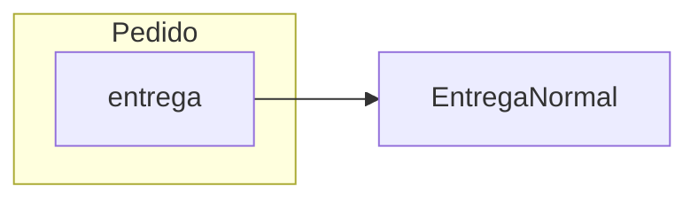

# Aula 12 — Quando um colaborador começa a variar

O Projeto 1 funciona: `Pedido` mantém seus itens, coordena o total e protege as
edições depois do fechamento. Nas Aulas 09 e 10, novas regras entraram sem
deslocar o trabalho de `Produto` e `ItemPedido`. Na Aula 11, usamos esse mesmo
raciocínio em uma missão com robôs, sensores e leituras.

Agora começa a **Unidade 02 — Colaboração, Contratos e Polimorfismo**. Vamos
retomar o pedido apenas como ponto de partida: chegou uma responsabilidade que
ainda não existia no sistema.

**Slides:** [Apresentação HTML](../slides/rendered/aula-12-quando-um-colaborador-comeca-a-variar.html) · [PDF](../slides/rendered/aula-12-quando-um-colaborador-comeca-a-variar.pdf)

!!! lesson-question "Pergunta central"

    Como evoluir uma colaboração quando o objeto que realiza o trabalho pode variar?

!!! lesson-objectives "Objetivos"

    Ao final deste estudo, você deverá ser capaz de:

    - acrescentar uma colaboração preservando as responsabilidades existentes;
    - distinguir mudança na regra de um colaborador de mudança na classe que realiza o trabalho;
    - identificar o que permanece estável e o que varia em uma colaboração;
    - analisar quanto conhecimento sobre alternativas concretas chega ao coordenador; e
    - selecionar comportamentos que precisam ser verificados antes de uma mudança estrutural.

<!-- Núcleo de 90 min: colaboração válida 25; segunda alternativa e propostas 30;
terceira alternativa e ponto de variação 20; verificações e síntese 15.
Elasticidade: comparar duas instâncias da mesma classe; localizar seleção em Main.
Atividades formativas: Nível 1 — Tutor, conforme práticas anteriores. -->

## Nosso pedido agora precisa de entrega

O novo requisito é simples:

> No fechamento, o cliente escolhe a forma de entrega do pedido. Inicialmente,
> só existe entrega normal, com custo fixo de R$ 10.

Nesta investigação, `calcularTotal()` continua significando **total dos itens**.
O pedido continua nascendo aberto, com a lista de itens vazia. A entrega é
escolhida **no fechamento**, quando passa a ser uma colaboração necessária.
Depois de fechado, o pedido conserva essa escolha. Neste cenário, consultamos
o custo da entrega separadamente e somente depois do fechamento; consultas
antecipadas não fazem parte desta investigação.

Quem deveria conhecer a regra que calcula o custo da entrega? `Pedido` já
coordena itens e protege sua estrutura. A entrega tem uma regra própria, que
pode ficar em outro objeto:

```java
public class EntregaNormal {
    public double calcularCusto(Pedido pedido) {
        return 10.0;
    }
}
```

O parâmetro permite receber o pedido para o qual o custo é calculado. Nesta
primeira regra, o valor é fixo e não precisa consultar seus dados. Receber o
pedido não cria outro pedido nem exige guardar uma referência para ele.

Em `Pedido`, acrescentamos o campo e passamos a receber a entrega em `fechar`.
O construtor sem argumentos continua criando um pedido aberto:

```java
// Trecho de Pedido; os imports de List e ArrayList continuam necessários.
private List<ItemPedido> itens;
private boolean fechado;
private EntregaNormal entrega;

public Pedido() {
    itens = new ArrayList<>();
    fechado = false;
}

public void fechar(EntregaNormal entrega) {
    if (!fechado && entrega != null) {
        this.entrega = entrega;
        fechado = true;
    }
}

public double calcularCustoEntrega() {
    return entrega.calcularCusto(this);
}
```

As operações da Versão 10 continuam na classe: `adicionarItem(Produto, int)`,
`removerItem(Produto)`, `alterarQuantidade(Produto, int)` e `calcularTotal()`.
A antiga operação `fechar()` é substituída por `fechar(EntregaNormal)`: só fecha
um pedido ainda aberto quando recebe um colaborador existente. Assim, a entrega
não é exigida na criação nem pode ser trocada por um segundo fechamento.

!!! java-focus "Java em foco — passar o próprio objeto"

    Em `entrega.calcularCusto(this)`, `this` é uma referência para o `Pedido`
    que está executando `calcularCustoEntrega()`. A chamada envia esse mesmo
    pedido como argumento. Não executa `new Pedido(...)` nem faz uma cópia.

Aqui vemos apenas a nova referência mantida pelo pedido. Os itens foram
omitidos porque já conhecemos aquela parte da estrutura. A seta significa
**aponta para**, e o campo está dentro do objeto a que pertence.



!!! activity "Atividade — explore a colaboração que funciona"

    1. Quem conhece a fórmula do frete? `Pedido` precisa saber que o custo é `10.0`?
    2. Qual referência o pedido mantém e qual operação solicita?
    3. Se o custo normal passar para `12.0`, qual classe deve mudar?
    4. Essa distribuição é adequada enquanto existe somente essa forma de entrega?

??? "Ver uma análise possível"

    1. `EntregaNormal` conhece a regra; `Pedido` apenas solicita o cálculo.
    2. Mantém uma referência de tipo `EntregaNormal` e solicita `calcularCusto(this)`.
    3. Muda `EntregaNormal`; o pedido continua fazendo a mesma chamada.
    4. Sim. Um objeto realiza a regra própria de entrega, e o pedido coordena a colaboração.

Antes de executar, preveja os dois valores impressos:

```java
Produto teclado = new Produto("Teclado", 150.0);
Produto mouse = new Produto("Mouse", 80.0);
EntregaNormal normal = new EntregaNormal();

Pedido pedido = new Pedido();
pedido.adicionarItem(teclado, 2);
pedido.adicionarItem(mouse, 1);
pedido.fechar(normal);

System.out.println(pedido.calcularTotal());
System.out.println(pedido.calcularCustoEntrega());
```

??? "Ver resultado"

    ```text
    380.0
    10.0
    ```

    O total dos itens continua vindo de `ItemPedido`. O custo da entrega vem de
    `EntregaNormal`. Acrescentar a entrega não mudou o significado de `calcularTotal()`.

A solução atende ao requisito. Não precisamos desfazer a colaboração para
preparar o próximo passo; precisamos observar o que acontece quando o requisito
muda.

## Chegou uma segunda forma de entrega

Alguns clientes agora precisam de entrega expressa. A nova regra tem custo fixo
de R$ 25:

```java
public class EntregaExpressa {
    public double calcularCusto(Pedido pedido) {
        return 25.0;
    }
}
```

Temos dois objetos possíveis para realizar conceitualmente o mesmo trabalho.
Vamos tentar fornecer o novo colaborador ao pedido atual:

```java
EntregaExpressa expressa = new EntregaExpressa();
Pedido urgente = new Pedido();
urgente.fechar(expressa);
```

!!! activity "Atividade — preveja antes de compilar"

    1. A operação de fechamento atual aceita essa chamada?
    2. A responsabilidade de coordenar o custo mudou? O comportamento solicitado mudou?
    3. O que as duas classes têm em comum do ponto de vista de quem precisa da entrega?

??? "Ver resposta"

    1. Não. `fechar` recebe `EntregaNormal`, e o argumento é `EntregaExpressa`.
       As classes mostradas são tipos distintos. Ter um método de mesmo nome
       não basta para que esse argumento seja aceito.
    2. Não. O pedido ainda precisa solicitar o custo da sua forma de entrega.
    3. Ambas oferecem `calcularCusto(Pedido)` e devolvem um `double`.
       O que mudou foi quem pode realizar o trabalho e a regra usada por esse objeto.

Mesmo trocar **somente** o parâmetro de `fechar` para `EntregaExpressa`
deixaria outro obstáculo: o campo ainda é `EntregaNormal`. Trocar ambos faria
pedidos normais perderem o encaixe nessa versão. Precisamos atender às duas
alternativas, não apenas substituir uma pela outra no código da classe.

Isso é diferente de trocar `Sensor temperatura` por `Sensor umidade`, como na
Aula 11: ali eram objetos diferentes **da mesma classe**. Aqui, o colaborador
pode pertencer a **outra classe**.

## Que soluções podemos propor com o repertório atual?

Antes de continuar, formule uma maneira de permitir pedidos normais e expressos
no mesmo programa. Use o que já conhece; depois avalie o conhecimento que sua
proposta exige de `Pedido`.

??? "Ver propostas possíveis"

    Podemos manter campos concretos separados, guardar um indicador da escolha
    ou reunir os cálculos no pedido. São caminhos investigáveis. O critério
    aqui é explicar quem conhece as alternativas e onde uma nova alternativa
    exigiria alterações.

Uma proposta mantém duas referências:

```java
// Proposta parcial, ainda sem operação de fechamento nem seleção.
private EntregaNormal entregaNormal;
private EntregaExpressa entregaExpressa;
```

Esses campos podem ser usados em uma solução funcional. Mas ainda precisamos
representar **qual forma pertence àquele pedido** e escolher qual objeto chamar.
Ter dois campos não responde sozinho a essa pergunta.

Outra proposta guarda um indicador, como `String tipoEntrega`, ou um código
numérico. Para analisar a consequência sem acrescentar sintaxe de texto, imagine
`tipoEntrega` como `int`: `1` é normal e `2` é expressa. O trecho abaixo supõe
esse campo e os dois colaboradores já inicializados, com um código válido:

```java
// Proposta de seleção dentro de Pedido.
public double calcularCustoEntrega() {
    if (tipoEntrega == 1) {
        return entregaNormal.calcularCusto(this);
    } else {
        return entregaExpressa.calcularCusto(this);
    }
}
```

Os valores `1` e `2` são apenas uma convenção desta proposta. Não definem uma
regra do projeto. O trecho permite discutir o impacto da seleção; não é uma
implementação completa a ser copiada como próximo estado do Projeto 1.

!!! activity "Atividade — siga o conhecimento, não conte condições"

    1. Nessa proposta, quem conhece as classes e o significado de cada escolha?
    2. Se as fórmulas voltassem para `Pedido`, qual responsabilidade ele absorveria?
    3. O problema investigado se resume a existir um `if`?

??? "Ver uma análise possível"

    1. `Pedido` conhece ambas as classes e decide qual deve atender à solicitação.
    2. Além de coordenar, passaria a conhecer as próprias regras de cálculo das entregas.
    3. Não. Um `if` pode expressar uma regra adequada. Aqui estamos investigando
       por que o pedido precisa conhecer cada alternativa concreta para solicitar
       uma responsabilidade que continua sendo a mesma.

Na Aula 09, `if (!fechado)` protegeu uma regra que pertence a `Pedido`.
Esse uso continua fazendo sentido. A pergunta nova é: **quanto conhecimento
sobre quem calcula entrega deve chegar ao pedido?**

## Uma terceira alternativa torna a diferença mais visível

Agora o cliente também pode retirar no local, com custo zero:

```java
public class RetiradaLocal {
    public double calcularCusto(Pedido pedido) {
        return 0.0;
    }
}
```

!!! activity "Atividade — analise o próximo impacto"

    Considere a proposta anterior, com campos separados e seleção em `Pedido`.

    1. Criar apenas `RetiradaLocal.java` faz essa alternativa funcionar pela operação de `Pedido`?
    2. Quais partes precisariam mudar para o pedido aceitar e selecionar a retirada?
    3. O que gostaríamos de conseguir trocar sem mudar o cálculo dos itens nem reescrever a coordenação da entrega?

??? "Ver resposta"

    1. Não. O pedido ainda só conhece as duas alternativas anteriores.
    2. Seria preciso adaptar referências, preparação da escolha e seleção em
       `Pedido`, além do cliente que solicita a nova opção. Só aumentar o `if`
       não resolve como o colaborador chega ao objeto.
    3. Gostaríamos de fornecer outro objeto que calcule o custo, preservando
       a solicitação desse comportamento pelo pedido.

A terceira alternativa não trouxe uma nova tarefa para `Pedido`. O custo ainda
precisa ser solicitado; cresceu o conjunto de objetos capazes de calculá-lo.

| O que permanece estável | O que varia |
| --- | --- |
| solicitar o cálculo do custo da entrega para um pedido | qual objeto atende à solicitação |
| receber um valor `double` como resultado | a regra: `10.0`, `25.0` ou `0.0` neste recorte |
| preservar itens, subtotais e regras de edição | a classe concreta usada como colaboradora |

!!! conceito-chave "Conceito-chave — ponto de variação"

    Um ponto de variação é uma parte do sistema em que esperamos alternativas
    de comportamento. Aqui, calcular o custo da entrega é a responsabilidade
    estável; entrega normal, expressa e retirada são as formas concretas de realizá-la.

## O que o tipo do campo está dizendo?

Volte à primeira solução:

```java
private EntregaNormal entrega;
```

Essa declaração diz: **“preciso de um objeto `EntregaNormal`”**.
Mas observe o uso que o pedido faz dele:

```java
return entrega.calcularCusto(this);
```

Que frase descreve a necessidade do pedido sem citar uma das alternativas?

??? "Ver uma formulação possível"

    “Preciso de algo capaz de calcular o custo da entrega para este pedido.”
    O pedido precisa desse comportamento, embora seu campo atual esteja
    declarado com uma classe concreta específica.

!!! conceito-chave "Conceito-chave — dependência concreta e acoplamento"

    Uma classe está acoplada a outra quando depende dela para realizar seu
    trabalho. Na primeira solução, `Pedido` depende concretamente de
    `EntregaNormal`: o campo e a operação de fechamento nomeiam essa classe.

Essa dependência era adequada ao requisito inicial. Dependências permitem a
colaboração que aprendemos na Unidade 01. O novo requisito revelou uma limitação
específica: queremos variar a classe colaboradora, mas a declaração pede uma só.

!!! trap "Armadilha — transformar dependência ou `if` em defeito automático"

    A quantidade de condições não decide sozinha se uma solução distribui bem
    responsabilidades. Investigue quem conhece a regra, quem conhece as
    alternativas e quem precisa mudar quando uma nova forma aparece.

### Para aprofundar: alguém ainda precisa escolher

<!-- aprofundamento-elastico -->

Mesmo que o pedido consiga trabalhar com diferentes colaboradores, algum ponto
do programa precisará escolher e criar a forma concreta de entrega. Considere
`Main`, que já monta os cenários. Escolher ali elimina a necessidade de expressar
o colaborador em `Pedido`? Por quê?

??? "Ver uma análise possível"

    Não. `Main` pode conhecer a alternativa escolhida, mas ainda precisa
    fornecê-la ao pedido. O campo `EntregaNormal` continua não aceitando os
    objetos das outras classes mostradas. Localizar a escolha ajuda a analisar
    responsabilidades, mas ainda falta representar a necessidade comum em Java.

## Antes de mudar uma colaboração que funciona

Estamos prestes a alterar uma relação do sistema. Fazer a entrega expressa
funcionar não basta para mostrar que as regras anteriores foram preservadas.

Considere novamente a **primeira solução executável**, com entrega normal e as
operações da Versão 10. Em um método `main`, este cenário reaproveita as mesmas
referências de produto em todas as chamadas:

```java
Produto teclado = new Produto("Teclado", 150.0);
Produto mouse = new Produto("Mouse", 80.0);
Pedido pedido = new Pedido();

pedido.adicionarItem(teclado, 2);
pedido.adicionarItem(mouse, 1);
System.out.println(pedido.calcularTotal());
pedido.removerItem(mouse);
System.out.println(pedido.calcularTotal());
pedido.alterarQuantidade(teclado, 3);
System.out.println(pedido.calcularTotal());

pedido.fechar(new EntregaNormal());
pedido.adicionarItem(mouse, 1);
pedido.removerItem(teclado);
pedido.alterarQuantidade(teclado, 1);
System.out.println(pedido.calcularTotal());
System.out.println(pedido.calcularCustoEntrega());
```

!!! activity "Atividade — escolha evidências para preservar"

    1. Quais são as cinco linhas esperadas?
    2. Que comportamentos esse cenário permite conferir?
    3. Executar uma vez e olhar o console seria suficiente para todas as mudanças futuras?

??? "Ver resposta"

    1. A saída é `380.0`, `300.0`, `450.0`, `450.0` e `10.0`, nessa ordem.
    2. Confere inclusão, cálculo, remoção, alteração positiva, preservação do
       total depois de tentativas de edição no pedido fechado e custo normal.
    3. Não. Precisamos repetir as verificações após mudanças. Automatizá-las
       ajudará a comparar os resultados obtidos com os esperados.

Esse cenário é um começo, não cobre todas as regras. Também precisamos verificar
separadamente quantidade zero, quantidade negativa, inclusão repetida da mesma
referência e pedidos independentes. Além disso, um total igual, sozinho, não
mostra cada detalhe da estrutura interna nem a localização das responsabilidades.

A próxima aula parte dessa necessidade: **como verificar que uma mudança não
quebrou comportamentos que já estavam corretos?** Depois, retomaremos o problema
de representar a colaboração que pode variar.

## Fechando a trajetória, mantendo o problema aberto

!!! synthesis "Síntese"

    - Na Unidade 01, aprendemos a decidir quem realiza cada responsabilidade e como os objetos colaboram.
    - Agora, mais de uma classe pode realizar a mesma responsabilidade de entrega.
    - A primeira colaboração funciona; a variação revelou o limite do tipo concreto escolhido.
    - Queremos expressar o comportamento necessário sem espalhar em `Pedido` o conhecimento de cada alternativa.
    - Antes de modificar essa estrutura, precisamos conseguir verificar os comportamentos anteriores.

```text
Unidade 01: objetos colaboram
                 ↓
Aula 12: um colaborador pode variar
                 ↓
Pedido precisa de “algo que calcule o custo da entrega”
                 ?
```

**Como representar em Java que `Pedido` precisa de “algo que calcula o custo da
entrega”, sem dizer qual classe concreta fará isso?**

Essa pergunta permanece aberta. O [Laboratório 12](laboratorio-12-quando-uma-segunda-solucao-aparece.md)
permite investigar o mesmo limite em outro domínio, usando apenas o repertório
que já construímos.

## Materiais relacionados

- [Aula 09 — Fechamento do pedido](aula-09-fechamento-do-pedido.md)
- [Aula 10 — Completando as regras do pedido](aula-10-completando-as-regras-do-pedido.md)
- [Aula 11 — Revisão da Unidade 01](aula-11-revisao-da-unidade-01.md)
- [Laboratório 10 — Completando as regras do pedido](laboratorio-10-completando-as-regras-do-pedido.md)
- [Laboratório 12 — Quando uma segunda solução aparece](laboratorio-12-quando-uma-segunda-solucao-aparece.md)
- [Java essencial para quem já sabe programar](../materiais/java-essencial.md)
