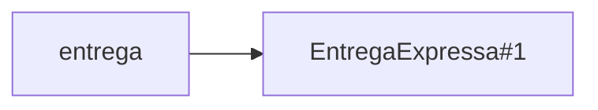

# Aula 14 — Do colaborador concreto ao contrato

Na Aula 12, `Pedido` passou a solicitar o cálculo do custo a uma entrega escolhida no fechamento. A colaboração com `EntregaNormal` funciona, mas outras classes capazes de calcular o custo não cabem no tipo declarado pelo pedido. Na Aula 13, escrevemos expectativas executáveis para verificar comportamentos antes de mudar essa estrutura. Agora vamos mudar **de que tipo de colaborador o pedido depende**.

**Slides:** [Apresentação HTML](../slides/rendered/aula-14-do-colaborador-concreto-ao-contrato.html) · [PDF](../slides/rendered/aula-14-do-colaborador-concreto-ao-contrato.pdf)

Este é o estado de partida de `Pedido`:

```java
private EntregaNormal entrega;

public void fechar(EntregaNormal entrega) {
    if (!fechado && entrega != null) {
        this.entrega = entrega;
        fechado = true;
    }
}
```

O pedido nasce aberto, sem entrega. A colaboração começa em `fechar(...)`; o primeiro fechamento válido conserva a escolha.

!!! lesson-question "Pergunta central"

    Como fazer `Pedido` depender do papel que a entrega cumpre, e não de uma classe concreta específica?

!!! lesson-objectives "Objetivos"

    Ao final deste estudo, você deverá ser capaz de:

    - identificar o tipo concreto que impede outra entrega de ocupar o mesmo papel;
    - formular e declarar um contrato com `interface` e fazer classes assumirem esse contrato com `implements`;
    - trocar a dependência de `Pedido` sem alterar o momento nem as regras do fechamento;
    - distinguir o tipo de uma referência da classe do objeto que ela alcança; e
    - verificar que uma nova entrega pode ser acrescentada sem modificar `Pedido`.

<!-- Núcleo de 90 min: impedimento e papel estável (20 min); contrato, mudança
e mesma chamada aceita (25 min); testes e nova entrega (25 min); referência,
objeto e síntese (20 min). Estimativas incluem previsão, leitura e discussão.
Elasticidade: segundo fechamento, método específico e necessidade de outros
contratos; aprofundamentos substituem parte do processamento conforme o ritmo. -->

## Por que a segunda entrega não cabe?

Além de `EntregaNormal`, agora existem `EntregaExpressa` e `RetiradaLocal`. Considere uma tentativa de usar a entrega expressa no pedido atual:

```java
Pedido pedido = new Pedido();
EntregaExpressa expressa = new EntregaExpressa();

pedido.fechar(expressa);
```

!!! activity "Atividade — preveja a compilação"

    1. A chamada `fechar(expressa)` compila com a declaração atual de `Pedido`?
    2. O impedimento é a ausência de `calcularCusto(Pedido)` em `EntregaExpressa`?
    3. Qual declaração pede especificamente uma classe concreta?

??? "Ver resposta"

    1. Não. `fechar` recebe `EntregaNormal`, mas `expressa` é uma referência para `EntregaExpressa`.
    2. Não. As duas classes oferecem `calcularCusto(Pedido)`; isso, sozinho, não torna seus tipos intercambiáveis na assinatura mostrada.
    3. `fechar(EntregaNormal entrega)` exige aquela classe, e o campo `private EntregaNormal entrega` guarda uma referência declarada com o mesmo tipo concreto.

O problema ficou visível quando surgiu outra classe para a mesma responsabilidade. Antes de escolher uma construção de Java, precisamos descrever **o que o pedido espera desse colaborador**.

## O papel que permanece estável

Compare as três classes conhecidas:

```java
public class EntregaNormal {
    public double calcularCusto(Pedido pedido) {
        return 10.0;
    }
}
```

```java
public class EntregaExpressa {
    public double calcularCusto(Pedido pedido) {
        return 25.0;
    }
}
```

```java
public class RetiradaLocal {
    public double calcularCusto(Pedido pedido) {
        return 0.0;
    }
}
```

As regras devolvem valores diferentes. O parâmetro `Pedido` está disponível para cada cálculo, embora estas regras fixas não precisem consultar seus dados. Do ponto de vista de `Pedido`, todas oferecem uma operação com o mesmo nome, parâmetro e resultado.

!!! activity "Atividade — descreva a necessidade sem citar uma classe"

    1. As três classes possuem a mesma implementação?
    2. Que operação `Pedido` solicita a qualquer entrega?
    3. Complete a frase: “Para calcular o custo, `Pedido` precisa de algo capaz de...”

??? "Ver resposta"

    1. Não. Cada classe realiza sua própria regra e devolve `10.0`, `25.0` ou `0.0` neste recorte.
    2. `calcularCusto(Pedido)`, que devolve um `double`.
    3. “...calcular o custo da entrega para este pedido.” A frase descreve o papel necessário sem escolher antecipadamente uma das classes.

!!! conceito-chave "Conceito-chave — contrato"

    Um contrato descreve o que um objeto precisa oferecer para ocupar determinado papel na colaboração. Aqui, esse papel é **calcular o custo da entrega de um pedido**. Classes diferentes podem cumpri-lo de maneiras diferentes.

## Dar forma ao contrato em Java

Java permite declarar esse papel como uma interface. Em `Entrega.java`:

```java
public interface Entrega {
    double calcularCusto(Pedido pedido);
}
```

!!! java-focus "Java em foco — declaração de interface"

    - `interface` declara um tipo que reúne operações exigidas pelo contrato.
    - A linha de `calcularCusto` informa resultado, nome e parâmetro, sem fornecer uma implementação.
    - Numa interface, essa operação é pública mesmo sem escrever `public`. Cada classe que a realiza deve oferecer uma implementação pública compatível.

`Entrega` não é uma entrega normal, expressa ou retirada. É o nome do **papel compartilhado**. A declaração ainda não calcula custo algum; as classes concretas continuam responsáveis por suas regras.

Para assumir esse contrato, cada classe declara `implements Entrega`:

Cada classe pública abaixo permanece em seu próprio arquivo `.java`.

```java
public class EntregaNormal implements Entrega {
    public double calcularCusto(Pedido pedido) {
        return 10.0;
    }
}
```

```java
public class EntregaExpressa implements Entrega {
    public double calcularCusto(Pedido pedido) {
        return 25.0;
    }
}
```

```java
public class RetiradaLocal implements Entrega {
    public double calcularCusto(Pedido pedido) {
        return 0.0;
    }
}
```

`implements Entrega` afirma que a classe oferece as operações exigidas pelo contrato. Se faltar `calcularCusto(Pedido)` com resultado `double` e acesso público, a classe concreta mostrada não satisfaz essa promessa.

!!! activity "Atividade — leia a promessa"

    Se `RetiradaLocal` declarar `implements Entrega`, mas não declarar `calcularCusto(Pedido)`, ela ainda poderá ser usada como uma entrega concreta compilável nesta solução? A interface obriga as três classes a devolver o mesmo valor?

??? "Ver resposta"

    Não. Uma classe concreta que afirma cumprir `Entrega` precisa oferecer a operação do contrato. A interface define **qual chamada é possível**, não um valor único: `RetiradaLocal` pode devolver `0.0` enquanto as demais devolvem `10.0` e `25.0`.

## Mudar a dependência de Pedido

Agora o pedido pode declarar o papel de que precisa. O campo e o parâmetro mudam de tipo; a regra do fechamento permanece:

| Declaração em `Pedido` | Antes | Depois |
| --- | --- | --- |
| Campo | `private EntregaNormal entrega;` | `private Entrega entrega;` |
| Parâmetro | `fechar(EntregaNormal entrega)` | `fechar(Entrega entrega)` |

```java
private Entrega entrega;

public void fechar(Entrega entrega) {
    if (!fechado && entrega != null) {
        this.entrega = entrega;
        fechado = true;
    }
}
```

A solicitação do custo continua igual:

```java
public double calcularCustoEntrega() {
    return entrega.calcularCusto(this);
}
```

Nesta investigação, `calcularCustoEntrega()` é chamado **depois** de um fechamento válido, como na Aula 12. `calcularTotal()` continua somando somente os itens.

!!! activity "Atividade — localize a mudança"

    1. Qual foi a mudança concreta nas declarações de `Pedido`?
    2. `Pedido()` passou a receber uma entrega?
    3. A guarda contra `null` e um segundo fechamento mudou?
    4. `Pedido` precisou aprender as fórmulas de custo das três classes?

??? "Ver resposta"

    1. O campo e o parâmetro de `fechar` passaram de `EntregaNormal` para `Entrega`.
    2. Não. O pedido continua nascendo aberto e sem entrega; recebe o colaborador em `fechar(...)`.
    3. Não. A condição `!fechado && entrega != null` continua protegendo a escolha inicial.
    4. Não. Ele continua chamando `entrega.calcularCusto(this)`; cada implementação conhece sua regra.

Antes, a dependência declarada era `Pedido → EntregaNormal`. Agora é `Pedido → Entrega`. Mudou **o tipo da dependência**, não a responsabilidade de `Pedido` nem o momento em que a colaboração começa.

Retome exatamente a tentativa que abriu a investigação, agora com as classes cumprindo `Entrega` e `Pedido` dependendo desse contrato:

```java
Pedido pedido = new Pedido();
EntregaExpressa expressa = new EntregaExpressa();

pedido.fechar(expressa);
System.out.println(pedido.calcularCustoEntrega());
```

!!! activity "Atividade — confira se o impedimento foi resolvido"

    1. A mesma chamada `fechar(expressa)` agora compila? O que mudou para isso acontecer?
    2. Qual valor é impresso? Quem conhece essa regra de custo?

??? "Ver resposta"

    1. Sim. `EntregaExpressa` declara `implements Entrega`, e o parâmetro de `fechar` agora é `Entrega`. Apenas mudar um desses lados não resolveria o encaixe mostrado.
    2. `25.0`. A implementação de `EntregaExpressa` calcula o custo; `Pedido` continua apenas solicitando o trabalho.

A chamada que antes não compilava agora produz o custo expresso. Isso resolve o novo encaixe, mas ainda precisamos verificar se os comportamentos anteriores foram preservados.

## Os testes verificam o que a mudança preservou

A chamada expressa foi aceita. Antes de considerar a mudança concluída, retomamos a suíte da Aula 13, com as mesmas entradas e expectativas:

| Teste existente | Comportamento a preservar |
| --- | --- |
| `calculaTotalDeUmItem()` | duas unidades de teclado a `150.0` somam `300.0` |
| `pedidoFechadoNaoAceitaNovosItens()` | a inclusão recusada mantém o total em `150.0` |
| `entregaNormalCustaDezReais()` | a entrega normal continua custando `10.0` |

Execute esses testes após a alteração. Eles devem continuar passando. O teste de entrega normal permanece assim:

```java
@Test
void entregaNormalCustaDezReais() {
    Pedido pedido = new Pedido();
    pedido.fechar(new EntregaNormal());

    assertEquals(10.0, pedido.calcularCustoEntrega());
}
```

A implementação do campo mudou, mas a expectativa pública não. Uma segunda verificação protege a escolha após o fechamento:

```java
@Test
void segundoFechamentoNaoTrocaEntrega() {
    Pedido pedido = new Pedido();
    pedido.fechar(new EntregaNormal());
    pedido.fechar(new EntregaExpressa());

    assertEquals(10.0, pedido.calcularCustoEntrega());
}
```

!!! activity "Atividade — leia o alcance das verificações"

    1. Se ambos os testes passarem depois da troca do campo para `Entrega`, o que ficou verificado?
    2. Isso demonstra que todas as regras do pedido e todas as formas de entrega funcionam?

??? "Ver resposta"

    1. Nestes cenários, a entrega normal ainda custa `10.0` e uma segunda chamada a `fechar(...)` não substitui a escolha inicial.
    2. Não. Cada teste cobre sua expectativa e seu cenário. Os testes retomados acima também verificam o total simples e uma inclusão recusada. Remoção, alteração de quantidade e custo expresso exigem seus próprios cenários se quisermos protegê-los automaticamente.

O Laboratório 13 aplicou a mesma ideia de proteção no Projeto 2, testando o contador de avisos de `Lembrete`. Aqui os exemplos de teste são para `Pedido`, que continua sendo o domínio das aulas.

Os comportamentos conhecidos continuam protegidos nesses cenários. Agora podemos verificar o ganho da mudança: o que acontece quando chega uma entrega que `Pedido` ainda não conhece?

## Uma nova entrega põe o contrato à prova

Chegou uma forma de entrega agendada, com custo fixo de R$ 15. Ela pode assumir o papel `Entrega`:

```java
public class EntregaAgendada implements Entrega {
    public double calcularCusto(Pedido pedido) {
        return 15.0;
    }
}
```

```java
Pedido pedido = new Pedido();
pedido.fechar(new EntregaAgendada());

System.out.println(pedido.calcularCustoEntrega());
```

!!! activity "Atividade — preveja o impacto"

    1. Qual valor é impresso?
    2. Para aceitar esta classe, precisamos alterar o campo, `fechar(...)` ou `calcularCustoEntrega()` em `Pedido`?
    3. Algum ponto do programa ainda precisa escolher e criar a entrega agendada?

??? "Ver resposta"

    1. `15.0`.
    2. Não. `EntregaAgendada` cumpre `Entrega`, que já é o tipo declarado pelo pedido. As operações de `Pedido` continuam iguais.
    3. Sim. O código que monta o cenário, como `Main`, precisa conhecer e criar a alternativa desejada para fornecê-la a `fechar(...)`. A escolha concreta continua existindo, mas não precisa ser incorporada à classe `Pedido`.

!!! conceito-chave "Conceito-chave — depender de uma capacidade"

    `Pedido` depende do contrato `Entrega`, que expressa a capacidade estável de calcular o custo. As classes concretas podem variar sem que `Pedido` precise nomear cada uma delas.

Compare as chamadas já observadas:

| Objeto fornecido no fechamento | Consulta pública | Resultado |
| --- | --- | ---: |
| `EntregaNormal` | `pedido.calcularCustoEntrega()` | `10.0` |
| `EntregaExpressa` | `pedido.calcularCustoEntrega()` | `25.0` |
| `EntregaAgendada` | `pedido.calcularCustoEntrega()` | `15.0` |

O corpo de `Pedido.calcularCustoEntrega()` permanece igual nos três casos. O contrato garante a operação disponível, mas **não exige o mesmo resultado**. O objeto escolhido continua realizando sua própria regra. Como uma referência declarada pelo mesmo contrato permite alcançar esses objetos diferentes?

## A referência conhece o contrato; o objeto continua concreto

O campo de `Pedido` agora tem tipo `Entrega`, mas o colaborador fornecido continua sendo um objeto concreto. Podemos observar a mesma distinção numa variável local:

```java
Entrega entrega = new EntregaExpressa();
```



A seta significa **aponta para**. O identificador `#1` apenas distingue essa instância no desenho; não é um endereço de memória. A variável `entrega` tem tipo declarado `Entrega`. O objeto criado por `new` continua sendo uma instância de `EntregaExpressa`. Não criamos um objeto com `new Entrega()`: a interface declara o papel, e as classes concretas fornecem objetos que o cumprem.

!!! activity "Atividade — separe variável e objeto"

    1. O que `new EntregaExpressa()` cria?
    2. Qual é o tipo declarado da variável `entrega`?
    3. A variável é o objeto? O objeto deixou de ser `EntregaExpressa`?

??? "Ver resposta"

    1. Cria um objeto concreto da classe `EntregaExpressa`.
    2. `Entrega`, o tipo da interface.
    3. Não. A variável guarda uma referência para o objeto. A declaração da variável não muda a classe do objeto que foi criado.

Esse é o raciocínio de referências da Aula 03, agora aplicado a uma referência declarada pelo contrato. O tipo declarado também determina **o que o código pode solicitar por meio daquela referência**.

### Para aprofundar: uma operação fora do contrato

<!-- aprofundamento-elastico -->

Suponha que a entrega expressa tenha uma operação própria, além da operação do contrato:

```java
public class EntregaExpressa implements Entrega {
    public double calcularCusto(Pedido pedido) {
        return 25.0;
    }

    public void priorizarNaFila() {
        // comportamento específico desta classe
    }
}
```

Com a variável declarada como `Entrega`:

```java
Entrega entrega = new EntregaExpressa();
Pedido pedido = new Pedido();
pedido.fechar(entrega);

entrega.calcularCusto(pedido); // compila
entrega.priorizarNaFila();     // não compila
```

!!! activity "Atividade — por que a segunda chamada falha?"

    O objeto possui `priorizarNaFila()`. Por que a chamada por `entrega` não compila? Se a variável fosse declarada `EntregaExpressa expressa = new EntregaExpressa();`, aquela operação estaria disponível?

??? "Ver resposta"

    O tipo da referência `entrega` é `Entrega`. Por meio dela, o compilador garante somente as operações declaradas no contrato, que não inclui `priorizarNaFila()`. Com uma referência declarada `EntregaExpressa`, a operação específica estaria disponível. O objeto não perdeu seu método; mudou o conjunto de operações que podemos solicitar **através daquela referência**.

### Para aprofundar: o segundo fechamento

<!-- aprofundamento-elastico -->

Considere um pedido que já foi fechado com entrega normal:

```java
Pedido pedido = new Pedido();
pedido.fechar(new EntregaNormal());
pedido.fechar(new EntregaExpressa());
```

Qual custo deve permanecer? A interface permitiu trocar a entrega depois do primeiro fechamento?

??? "Ver resposta"

    O custo permanece `10.0`. O segundo `fechar(...)` recebe um objeto de tipo aceito pelo contrato, mas a guarda `!fechado` impede substituir a escolha já conservada pelo pedido. Aceitar mais classes não altera essa regra de estado.

### Para aprofundar: contratos surgem de uma necessidade

<!-- aprofundamento-elastico -->


Aprender `interface` não torna necessário criar uma interface para todas as classes. No problema atual, a responsabilidade “calcular o custo da entrega” é estável, e já existem várias classes concretas que precisam ocupar esse papel no mesmo ponto de colaboração.

!!! activity "Atividade — uma interface para cada classe?"

    Devemos criar `ProdutoInterface` ou `ItemPedidoInterface` só porque agora conhecemos `interface`? Que evidência pediríamos antes de acrescentar um contrato nesses lugares?

??? "Ver uma análise possível"

    Não há necessidade mostrada neste problema para criar essas interfaces. Antes, identificaríamos um papel que algum cliente precisa e uma razão concreta para depender desse papel em vez de uma classe específica, como variações que devem caber na mesma colaboração. A existência de uma classe, por si só, não exige uma interface correspondente.

## Fechando a trajetória

!!! synthesis "Síntese"

    - Na Aula 12, a assinatura de `Pedido` aceitava somente `EntregaNormal`; outras classes podiam calcular custo, mas não ocupar aquele parâmetro.
    - Na Aula 13, aprendemos a registrar expectativas para detectar alterações de comportamento.
    - Nesta aula, `Entrega` nomeia o papel estável; as classes concretas o assumem com `implements`.
    - `Pedido` mantém sua regra de fechamento e passa a depender do contrato, podendo receber novas entregas sem ser modificado.
    - Uma referência do tipo `Entrega` permite solicitar o contrato, enquanto o objeto alcançado continua pertencendo à sua classe concreta.

```java
private Entrega entrega;

public double calcularCustoEntrega() {
    return entrega.calcularCusto(this);
}
```

No [Laboratório 14](laboratorio-14-um-contrato-para-os-avisos.md), a capacidade comum será enviar uma mensagem: `Lembrete` passará a depender de `Notificador`. A entrega de `Pedido` é escolhida no fechamento; o canal inicial do lembrete continua sendo recebido na criação. O contrato muda o tipo de colaborador aceito, sem decidir quando cada modelo deve recebê-lo.

**Quando essa chamada acontece, como Java sabe qual implementação de `calcularCusto()` executar?** Essa é a pergunta de entrada para a Aula 15 — *Polimorfismo: a mesma mensagem, comportamentos diferentes*.

## Materiais relacionados

- [Aula 12 — Quando um colaborador começa a variar](aula-12-quando-um-colaborador-comeca-a-variar.md)
- [Aula 13 — Como saber se ainda funciona?](aula-13-como-saber-se-ainda-funciona.md)
- [Laboratório 13 — Protegendo os avisos do lembrete](laboratorio-13-protegendo-os-avisos-do-lembrete.md)
- [Laboratório 14 — Um contrato para os avisos](laboratorio-14-um-contrato-para-os-avisos.md)
- [Java essencial para quem já sabe programar](../materiais/java-essencial.md)
