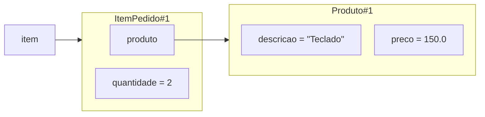

# Design system para diagramas de objetos e referências

Este documento define a notação visual reutilizável para diagramas que representam o estado de execução de programas orientados a objetos. Ele se aplica ao site, aos slides e a novos materiais da disciplina.

O diagrama deve comunicar primeiro pela posição, contenção, forma e conexão. Texto explica nomes e valores do programa; não repete continuamente categorias como “variável”, “objeto”, “campo” ou “referência”.

## Leitura fundamental

O fluxo preferencial é da esquerda para a direita:

**variável externa → objeto → campo de referência → outro objeto**

- uma seta significa somente **aponta para**;
- contenção significa **pertence ao estado deste objeto**;
- `=` apresenta um valor mantido diretamente no campo ou elemento;
- identificadores como `Produto#1` distinguem identidades relevantes somente no contexto do diagrama atual.

Não representar pilha, heap, endereço, JVM ou detalhes de implementação quando eles não forem necessários para a pergunta didática.

## Elementos visuais

### Variável de referência

- caixa pequena, branca ou quase branca;
- borda vermelha fina;
- texto monoespaçado com apenas o nome, como `item` ou `pedido`;
- posicionada fora dos objetos;
- uma seta parte da caixa e termina no objeto acessado.

### Objeto

- contêiner de borda azul e fundo claro;
- cabeçalho azul muito suave com o nome da classe ou identidade, como `Produto#1`;
- campos relevantes aparecem como linhas compactas abaixo do cabeçalho;
- o prefixo “objeto” não aparece no cabeçalho.

Usar `Classe#n` somente quando distinguir identidades contribuir para o raciocínio. O sufixo identifica uma instância apenas dentro do diagrama atual: não representa endereço de memória, não é identidade persistente e não precisa ser conservado entre slides.

Quando há um único objeto relevante, o nome da classe basta: `Produto`. Quando a comparação depende de duas identidades, usar, por exemplo, `Produto#1` e `Produto#2`.

### Campo de referência

- linha compacta dentro do objeto;
- nome monoespaçado, como `produto` ou `itens`;
- marcador vermelho discreto ou texto vermelho diferencia o slot de referência;
- uma seta parte desse slot e termina no objeto acessado;
- não escrever “campo” nem “(referência)”.

Quando a seta estiver presente, preferir apenas `produto` no slot. Em uma representação sem conexão gráfica, usar `produto → Produto#1`.

### Campo de valor

- linha neutra dentro do objeto;
- em diagramas de estado de execução, o formato padrão é `nome = valor`, como `quantidade = 2`, `preco = 150.0` ou `descricao = "Teclado"`;
- `nome: Tipo = valor` é uma exceção deliberada, usada somente quando o tipo contribuir para o raciocínio daquele diagrama;
- não repetir tipos que o estudante já pode obter do código apenas para tornar os slots uniformes;
- `String` pode ser tratada como valor conceitual do domínio quando a distinção de sua natureza referencial não fizer parte da pergunta.

Diagramas de estado mostram prioritariamente identidade, referências, estrutura e valores. Diagramas cujo foco seja declaração, visibilidade ou algum mecanismo específico de Java podem conservar tipos e modificadores relevantes, mas essa decisão deve ser feita semanticamente, nunca por transformação automática.

### Coleção

- objeto próprio com cabeçalho, como `ArrayList<ItemPedido>#1`;
- elementos em linhas indexadas: `[0]`, `[1]`, ...;
- cada linha de referência aponta para o objeto correspondente;
- não criar uma caixa grande para cada elemento;
- expandir o elemento dentro da coleção somente quando seu conteúdo interno for a pergunta didática.

## Conexões e composição

- preferir `flowchart LR` em Mermaid e layouts horizontais nos slides;
- usar linhas retas ou ortogonais;
- alinhar fontes e destinos para reduzir curvas, cruzamentos e setas diagonais;
- duas referências para a mesma identidade devem terminar claramente no mesmo contêiner;
- não usar uma seta para dizer que um campo pertence a um objeto: a contenção já comunica isso;
- omitir campos, variáveis e objetos que não contribuam para o raciocínio atual.

## Participantes em diagramas de sequência

Uma lifeline pode representar uma identidade concreta, um participante conceitual ou um papel ocupado por diferentes objetos durante a execução. O rótulo deve tornar essa leitura inequívoca:

- usar apenas a classe, como `Pedido`, quando houver uma única instância relevante ou quando a lifeline representar claramente um participante conceitual;
- usar `papel : Tipo`, como `item atual : ItemPedido`, `produto do item : Produto` ou `aluno atual : Aluno`, quando diferentes instâncias puderem ocupar aquele papel ao longo de uma coleção, laço ou algoritmo;
- não criar uma lifeline para cada elemento da coleção, salvo quando distinguir as identidades for a própria pergunta didática.

O nome da classe é suficiente quando não existe risco real de confundir papel e identidade. Em percursos, o papel explícito ajuda o estudante a perceber que a mesma lifeline representa participantes sucessivos, e não uma única instância fixa.

## Cores semânticas e temas

O contrato estável é semântico: vermelho indica referência, azul delimita objeto e tons neutros representam valor ou estrutura. Os valores concretos pertencem ao tema e podem evoluir sem alterar a notação.

| Semântica | Token | Light | Dark |
| --- | --- | --- | --- |
| borda de referência | `--poo-ref-border` | vermelho moderado | vermelho claro suave |
| texto de referência | `--poo-ref-text` | vermelho profundo | vermelho muito claro |
| fundo de referência | `--poo-ref-bg` | quase branco quente | vinho quase neutro |
| borda de objeto | `--poo-object-border` | azul médio | azul claro |
| fundo do cabeçalho | `--poo-object-header-bg` | azul muito claro | azul profundo dessaturado |
| borda do cabeçalho | `--poo-object-header-border` | azul claro | azul médio dessaturado |
| texto do cabeçalho | `--poo-object-header-text` | azul profundo | azul muito claro |
| fundo de objeto | `--poo-object-bg` | quase branco | azul-cinza escuro |
| borda de valor | `--poo-value-border` | cinza azulado claro | cinza azulado médio |
| fundo de valor | `--poo-value-bg` | cinza muito claro | cinza azulado escuro |
| texto de valor | `--poo-value-text` | grafite | quase branco azulado |
| seta | `--poo-arrow` | vermelho profundo | vermelho claro |
| texto geral | `--poo-diagram-text` | grafite | quase branco azulado |
| texto secundário | `--poo-diagram-muted` | cinza azulado | cinza azulado claro |

Os códigos de cor ficam centralizados em `slides/theme/poo.css` e `docs/stylesheets/extra.css`. Não devem ser copiados para diagramas individuais.

Cor nunca deve ser a única pista. Forma, posição, cabeçalho, contenção, índice e direção das setas preservam a leitura em projeções com contraste reduzido e para pessoas com percepção de cor reduzida.

## Legenda

Usar no máximo uma legenda pequena por diagrama, e somente quando a convenção ainda não tiver sido apresentada no material. A legenda canônica é:

- borda vermelha: lugar que guarda uma referência;
- contêiner azul: objeto;
- seta: aponta para;
- linha interna: campo ou elemento pertencente ao contêiner.

Não repetir a legenda em todos os diagramas de uma mesma aula.

## Template Mermaid

O template abaixo é a base para novos diagramas do site. Os identificadores de estilo `pooVar`, `pooObject`, `pooRefSlot` e `pooValueSlot` fazem parte do design system e devem permanecer estáveis. Eles não são classes do domínio: nomes como `Produto` e `ItemPedido` variam conforme o exemplo.

As cores são aplicadas pelo CSS compartilhado do site, inclusive no esquema `slate`. Não declarar `classDef`, `style` ou `linkStyle` com cores dentro de cada diagrama.

````markdown

````

## Componentes Marp

O tema `slides/theme/poo.css` fornece os seguintes componentes:

- `.poo-diagram`: grade principal da composição;
- `.poo-var`: variável externa;
- `.poo-arrow`: conexão horizontal de referência;
- `.poo-object`: contêiner do objeto;
- `.poo-object__header`: cabeçalho com classe ou identidade;
- `.poo-slots`: conjunto de campos ou elementos;
- `.poo-slot`: linha interna neutra;
- `.poo-slot--ref`: linha interna que guarda referência;
- `.poo-collection`: variante semântica para coleções;
- `.poo-legend`: legenda global opcional.

Quando múltiplas referências apontarem para o mesmo objeto, usar SVG inline somente para as linhas e pontas de seta, mantendo variáveis e objetos nos componentes anteriores. Não usar caracteres `↘`, `↗` ou curvas como substitutos para conexões estruturais.

## Tipografia e densidade

Nunca reduzir significativamente o tamanho da fonte apenas para fazer um diagrama caber. A legibilidade em projeção tem prioridade sobre a quantidade de informação.

Se o diagrama ficar denso demais:

1. eliminar informação não essencial;
2. reorganizar o layout;
3. dividir a explicação em dois estados ou frames;
4. usar revelação progressiva.

Os tamanhos devem acompanhar a escala responsiva do material. Evitar valores absolutos específicos por diagrama.

## Checklist de autoria

Antes de publicar ou projetar, verificar:

1. nomes como “objeto”, “campo”, “variável” e “(referência)” foram removidos quando a estrutura já comunica a categoria;
2. variáveis são pequenas e objetos possuem cabeçalhos claros;
3. campos e elementos são linhas compactas;
4. valores usam `=` e referências usam setas;
5. múltiplas referências chegam visualmente ao mesmo objeto;
6. o fluxo principal segue da esquerda para a direita;
7. linhas não cruzam conteúdo nem dependem de curvas difíceis de seguir;
8. o diagrama continua legível em projeção e sem depender apenas de cor.
9. o mesmo diagrama preserva contraste, hierarquia e semântica nos temas claro e escuro;
10. nenhuma fonte foi reduzida de modo significativo apenas para evitar overflow.
11. tipos aparecem em campos de estado somente quando são parte do raciocínio;
12. lifelines em percursos distinguem claramente papel, tipo e identidade quando houver risco de ambiguidade.
